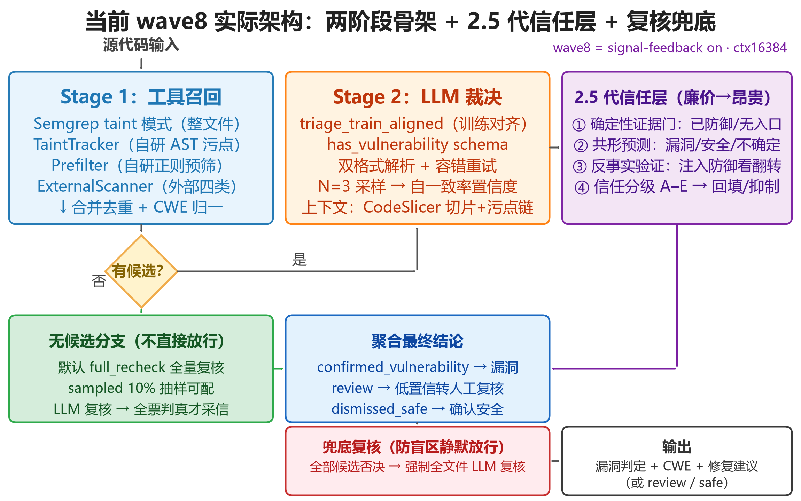
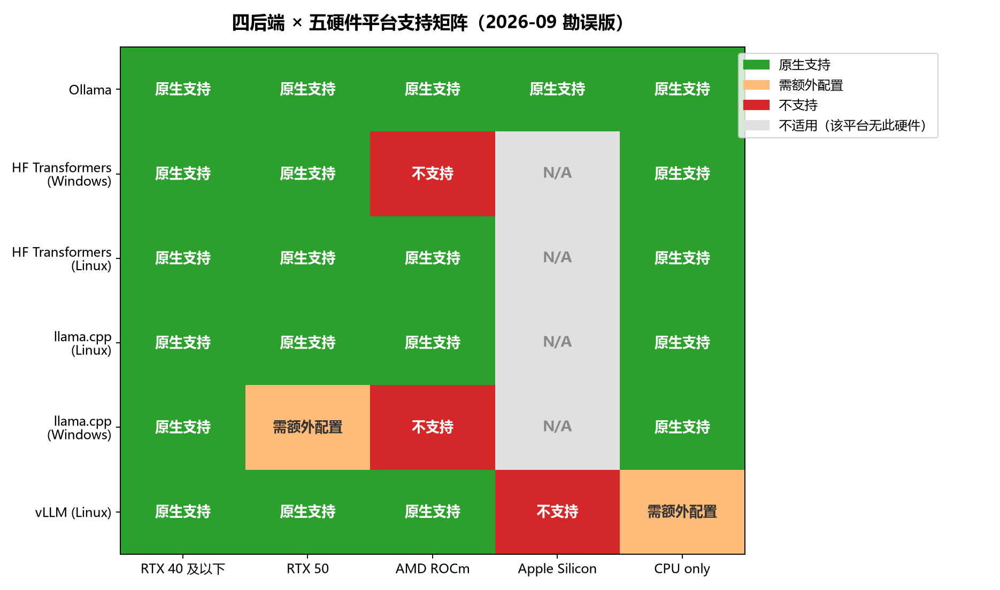
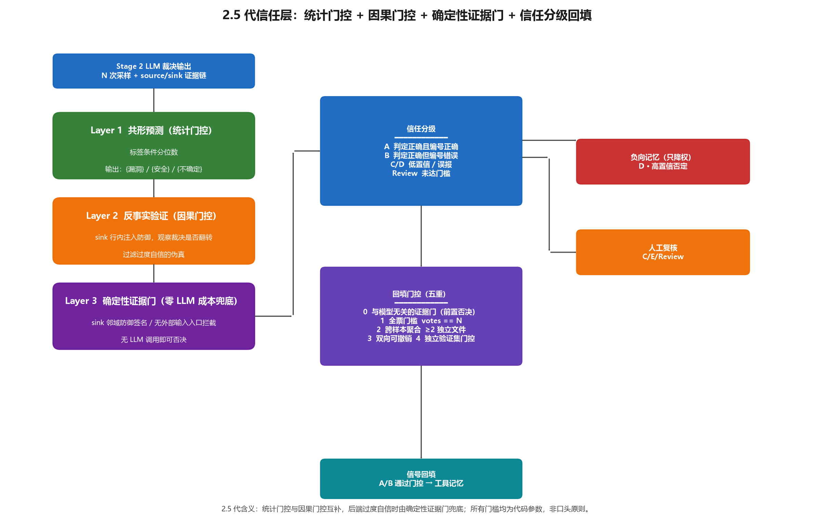
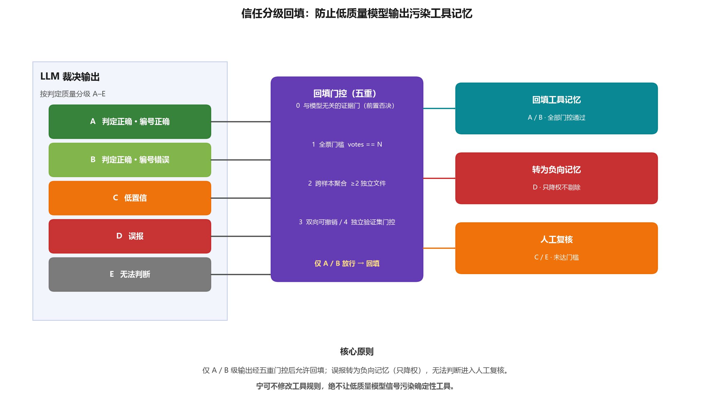

# 论文写作素材库

> 本库按实验、后端、前端、插件、项目级亮点与难点、未来规划、PPT 七个方向，归档论文写作可直接引用的素材。每条素材均标注来源文件，定稿前可按来源追溯核对。
>
> 收录原则：只收录**已确证、可直接引用**的事实；"计划中 / 未执行"的内容单独成章并明确标注状态。


## 目录

- 写作口径须知（引用前必读）
- 一、实验模块
  - 1.1 核心实验数据（统一打分，分层对比）
    - 层 1 系统级最好成绩（两阶段）← 论文主数据
    - 层 2 SFT 纯模型演进主线
    - 层 3 v9max 管道形态对比
    - 层 4 零样本基线（exp_01~05）
    - 层 5 工具层质量与缺陷分级
    - 层 6 测试面构成与典型性阶梯
    - 层 7 过程档案（不参与对比）
  - 1.2 策略转变与关键决策（已并入五章，见 5.0）
  - 1.3 巧妙的实验设计
  - 1.4 失败经历与教训
- 二、后端模块
  - 2.1 架构设计亮点
  - 2.2 巧妙的工程逻辑
  - 2.3 自研工具与关键实现细节
  - 2.4 部署与发布工程
- 三、前端模块（精简为 4 条核心亮点）
- 四、插件模块（VS Code + IntelliJ，精简为 4 条核心亮点）
- 五、项目级亮点、创新点与关键策略（含 5.0 关键策略决策一览）
- 六、项目级难点与应对
- 七、规划与未来目标：Nivis-α1
- 八、PPT 专用素材
- 附录：代码审查验证记录

## 写作口径须知（引用前必读）

1. **一套分数规则走全程**：acc = (TP+TN)/(TP+TN+FP+FN)（已裁决样本）；strict = 判真且 CWE 归因正确（Normalizer + 父子族匹配）；micro / macro = 实例级 recall；加权 = 风险加权分（冻结权重表）。基准答案 = 2026-09-02 官方口径修正版；全部数字可由 `scripts/score_batch.py` 复现。
2. **两阶段系统**：review 未决率与 acc 成对引用；干净评估（fixed5，`--no-signal-feedback`）与完整信任层（wave8，signal_feedback on）引用时注明组态。
3. **推理管道**：HF（NF4 + FP16 LoRA）与 Ollama（Q4_K_M 合并量化）指标不同，引用注明管道。
4. **CVE-fix 为全正样本集**：只有 recall / acc 有意义，FPR 无定义。
5. **核心 SFT 叙事**：SFT 收益集中在判别与格式（CVE-fix recall 0.375→0.950）；CWE 归因不随 SFT 提升，靠后处理纠正 + 两阶段架构补足；FPR 由两阶段信任层收敛（0.154→0.0435）。

## 一、实验模块

> **统一口径（全章所有表格同一套分数规则）**：acc = (TP+TN)/(TP+TN+FP+FN)（已裁决样本）；strict = 判真且 CWE 归因正确（纠正口径，含父子族匹配）；micro / macro = 实例级 recall；加权 = 风险加权分（冻结权重表 `experiments/scoring_config/weights_20260903.json`）。基准答案 = 2026-09-02 官方口径修正版。两阶段系统的 review 未决率单独标注、与 acc 成对引用。全部数字由 `experiments/scoring.py` 重算，`scripts/score_batch.py` 可复现（48 个运行全表：`experiments/exp_06_finetune/results/unified_score_table_20260903.md`）。

### 1.1 核心实验数据（分层对比）

#### 层 1：系统级最好成绩（两阶段架构，论文主数据）

| 系统组态 | 测试集 | recall | FPR | acc | 未决率 | strict | micro | 加权 |
|---|---|---|---|---|---|---|---|---|
| 两阶段·完整信任层（wave8，signal_feedback on + ctx16384） | 87 合成 | **1.000** | **0.0435** | **0.987** | 13.8% | **0.923** | 0.778 | **0.862** |
| 两阶段·干净评估（fixed5，`--no-signal-feedback`） | 87 合成 | 1.000 | 0.0435 | 0.987 | 12.6% | 0.774 | 0.592 | 0.786 |
| 两阶段（CVE-fix anchor，09-01） | CVE-fix 20 | 0.941 | — | 0.941 | 15.0% | 1.000 | 0.895 | 0.864 |
| 两阶段·α0 combined_nosource（rolling_dev 首跑，09-07） | rolling_dev 50 | 0.645 | — | 0.645 | 38.0% | 0.450 | 0.290 | 0.480 |
| 纯 LLM 对照（α0.5 combined） | 87 合成 | 0.967 | 0.154 | 0.931 | 0 | 0.898 | 0.675 | 0.829 |

- 架构收益一目了然：**FPR 0.154→0.0435**（两阶段信任层收敛误报）、**归因 strict 0.898→0.923 / micro 0.675→0.778**（工具证据链反哺归因）。
- 唯一 FP 为 `hard_crossfile_01_input`（CWE-441 缺失型，无确定性校验手段，论文写局限）；wave8 较 fixed5 多 1 段进 review（更保守，非退步）；干净评估与完整形态引用时注明组态。
- **rolling_dev 首跑（真实完整文件，50 段全为漏洞样本，无安全样本故 FPR 不可计算）**：同测试面裸判基线 α0.5·combined 为 recall 0.467 / strict 0.115 / micro 0.120 / 加权 0.240（未决 0），两阶段首跑提升至 **recall 0.645 / strict 0.450 / micro 0.290 / 加权 0.480**，即 recall +17.8pt、strict +33.5pt、加权翻倍；代价是 **19/50（38%）进 review**（两阶段在真实文件上偏保守）。漏报拆解：Stage 1 无候选 10 / Stage 2 否决 1 / review 19——**真实完整文件的召回缺口主要在 Stage 1 工具召回**（与层 5「A 工具召回覆盖率 59.0%」同源），不是裁决端。组态：α0（nivis-alpha0）+ combined_nosource + 全工具 + signal_feedback on + conformal on + full_recheck；注意裸判对照用的是 α0.5，两阶段用 α0，跨版本比较需注明。

#### 层 2：纯模型演进主线（SFT，87 合成集统一打分）

| 版本 | recall | FPR | acc | strict | micro | macro | 加权 | CVE-fix recall |
|---|---|---|---|---|---|---|---|---|
| 基线 qwen3-8b 零样本 | 0.967 | 0.269 | 0.897 | 0.848 | 0.651 | 0.579 | 0.771 | 0.375（8 段小集） |
| v2（首个 SFT） | 0.967 | 0.231 | 0.908 | 0.864 | 0.639 | 0.583 | 0.774 | 0.625（8 段小集） |
| v3 | 0.984 | 0.192 | 0.931 | 0.833 | 0.626 | 0.539 | 0.808 | 0.500（8 段小集） |
| v5（首个可信基线） | 1.000 | 0.231 | 0.931 | 0.836 | 0.639 | 0.579 | 0.805 | 0.571（7 段小集） |
| v7 | 0.983 | 0.231 | 0.919 | 0.767 | 0.578 | 0.479 | 0.776 | 0.800（20 段） |
| **v9max（HF 云端 ckpt）** | 1.000 | 0.423 | 0.874 | 0.754 | 0.578 | 0.484 | 0.730 | **0.950（20 段）** |
| α0·combined | 0.934 | 0.077 | 0.931 | 0.789 | 0.554 | 0.408 | 0.800 | 0.900（20 段，Ollama base） |
| **α0.5·combined（纯 LLM 主数据）** | 0.967 | 0.154 | 0.931 | **0.898** | **0.675** | 0.574 | **0.829** | 0.850（20 段，no-merge） |
| 两阶段管道·裸 LLM 对照（09-01） | 1.000 | 0.053 | 0.987 | 0.983 | 0.769 | 0.701 | 0.852 | — |

- **核心叙事**：SFT 把真实集 recall 从 0.375 拉到 0.950（判别与格式收益）；strict/micro 全程不涨（CWE 归因不靠 SFT 注入）→ 由后处理纠正 + 两阶段架构补足；FPR 的最终收敛靠两阶段（0.423→0.0435）。
- 失败版本 v4（训练-测试泄漏）/ v6（负迁移）/ v8（FP 激增）见 1.4 与层 7。

#### 层 3：v9max 管道形态对比（引用必须注明形态）

| 形态 | 测试集 | recall | FPR | acc | strict | micro | 加权 |
|---|---|---|---|---|---|---|---|
| HF 云端 ckpt（NF4 + FP16 LoRA 增量口径解释） | 87 合成 | **1.000** | 0.423 | 0.874 | 0.754 | 0.578 | 0.730 |
| Ollama Q4_K_M·combined | 87 合成 | 0.951 | **0.077** | **0.943** | 0.828 | 0.615 | 0.796 |
| Ollama Q4_K_M·base | 87 合成 | 0.934 | 0.192 | 0.897 | 0.807 | 0.578 | 0.776 |
| Ollama Q4_K_M·anti_fp_cot | 87 合成 | 0.918 | 0.115 | 0.908 | 0.786 | 0.566 | 0.762 |
| HF 云端 ckpt（跑A / 跑B） | CVE-fix 20 | 0.950 ×2 | — | 0.950 | 0.789 / 0.737 | 0.727 / 0.682 | 0.841 / 0.818 |
| Ollama Q4_K_M·base / combined | CVE-fix 20 | 0.789 / 0.750 | — | 0.789 / 0.750 | 0.875 / 1.000 | 0.727 / 0.727 | 0.727 / 0.750 |

- 量化缺口（1.000→0.934~0.951）来自两种 4-bit 管道差异（HF LoRA 增量 FP16 vs 合并后整体 Q4_K_M），不是"量化 vs 未量化"；Ollama combined 的 FPR 反而更低（合并量化抹平过度敏感模式）。

#### 层 4：零样本基线（exp_01~05）

**G0 重跑后（qwen3-8b，文件名泄漏已修复）**：

| 实验 | recall | FPR | acc | 说明 |
|---|---|---|---|---|
| exp_01 能力摸底（14 段典型） | 1.000 | 0.500 | 0.929 | 1 个安全样本误报 |
| exp_04 难样本 repeat=3（87 段多数表决） | 0.918 | 0.077 | 0.920 | 非独立 held-out，趋势参考 |
| exp_05 消融 repeat=3·combined | 0.918 | 0.077 | 0.920 | FPR 最优策略 |

- **LLM vs 传统工具**（14 段典型，exp_02）：LLM recall 1.000 / FPR 0.000 / acc 1.000（7.65s）vs Bandit 0.833 / 0.500 / 0.750（0.04s）vs Semgrep 0.750 / 0.000 / 0.786（8.9s）。关键案例：`path_traversal_01.py` 两个工具双漏报（`os.path.join` 不做规范化需语义理解）、Bandit 把安全写法报 3 条误报。
- **多模型横评**（87 段零样本，exp_04）：gemma4:12b/26b 最优 acc 0.943 / recall 0.950 / FPR 0.074；deepseek-coder-v2:16b FPR 0.444（幻觉式误报）；qwen2.5-coder:7b 以"精度 × 体积 × 速度"综合入选微调基座。
- **RAG（exp_03）**：典型样本 acc 保持 1.000、耗时 +2%；价值 = 可解释性与知识可扩展性，难样本无统计显著提升（四组 A/B/C/D 消融结论一致）。Top-K 对照 K=5 recall 1.000 / K=3 综合最优。

#### 层 5：工具层质量与缺陷分级（两阶段 Stage 1 侧）

| 指标 | 定义 | fixed5 |
|---|---|---|
| A 工具召回覆盖率 | 工具产出 ≥1 confirmed 候选的漏洞样本占比 | 59.0% |
| B 提示到点率 | 提示类型与真值同族匹配（召回子集） | 86.1% |
| D 误导率 | 噪音提示被模型判型采信 | 14.3% |

- 剩余缺口 = 逻辑漏洞（CSRF/JWT/竞态/弱加密）无专用规则，归训练侧 α1。
- **同口径净增益**（16384 组态带工具 vs 裸 LLM）：strict_acc +3.8pt、strict_recall +4.5pt，FPR 持平；兜底判真占比裸 LLM 100% → 带工具 5%（工具把 LLM 注意力从全文件盲判压缩到候选裁决）。
- **缺陷分级 F1~F12**（87 段逐样本归因沉淀）：F11 有证据不敢定论（27%，蒸馏缺证据层级 → E3/E2/E1 方案 + g21~g24 辨析组入库）、F12 密码学编号族混淆（327/329/330/338 组内互斥边界）为最后两类主要缺陷。
- **预筛层独立评估**（prefilter_eval，87 段）：coverage 13.8%（decided 53/87）、decided strict acc 0.943；CVE-fix 20 段 coverage 0.60、decided strict acc 0.75——预筛只做漏斗不判真伪，高 decided 精度支撑"工具候选可信"假设。
- **形态规则天花板**：可学率 17%~30%（双法交叉），真实 CVE 修复 82% "在别处加校验"，行级形态原理上无从判别——形态规则定位 = 第一道粗筛，主力召回靠数据流 + LLM 语义。

#### 层 6：测试面构成与典型性阶梯

| 测试面 | n | 构成 | 该面最好成绩（系统注明） |
|---|---|---|---|
| 87 合成集 | 87 | 合成教学（典型性 72%） | wave8 两阶段 recall 1.000 |
| CVE-fix | 20 | 真实 CVE 最小化片段（60%） | anchor 两阶段 recall 0.941 |
| rolling_dev | 50 | 真实完整文件（6%，SHA-256 冻结） | 两阶段·α0 首跑 recall 0.645 / strict 0.450（09-07；裸判 α0.5 为 0.467 / 0.115） |

- 真实度上升、成绩下降的梯度本身就是发现：合成形态高召回不可外推（SQLi 的 A 类修复仅 1/18）。**梯度现已三面齐全且均为两阶段口径**：合成 87 段 recall 1.000 → 真实 CVE 片段 20 段 0.941 → 真实完整文件 50 段 0.645，典型性 72%→60%→6% 单调下降与之对应。
- 官方背书：68 个真实 CVE 逐条对照 MITRE v4.20 + NVD + GHSA（94% 匹配，11 处错标修复）；外部数据面可信度分级：87 段/php-goof/nodegoat/VFlask = A，dvna = B-，rolling_dev/train_pool = C+（仅差分法度量），cve_fix/corpus raw = 未验证。

#### 层 7：过程档案（历史运行索引，不参与上面对比）

- 失败版本：v4 训练-测试泄漏整版废弃；v6 hard-negative 负迁移；v8 判别焦虑 + 矛盾信号 + 过拟合三根因。
- DPO 本地三次失败（OOM ×2、NF4 梯度失效）→ 偏好优化划归云端；on-policy 偏好对因模板化整体隔离。
- G0 九条方法学修复（文件名泄漏、repeat 默认、严格口径指标等）后全部重跑；v7 与 v5 合成集差异 Bootstrap 检验无统计显著性（p>0.05）。
- fixed1→fixed5 五轮收敛与裁决式 4 变体消融弃用：裁决 prompt 任务形态必须与训练分布对齐。
- α0 全 11 变体、α0.5 min/lite/full 细分、早期重复跑、Qwen2.5 归档（不可比）：统一口径数字见全表文件；训练配置 / 经济性（蒸馏+训练约 100 元）/ 标注修正史见 `EXPERIMENT_LEDGER.md` 与各结果文件。

### 1.2 策略转变与关键决策（已并入第五章）

> 本项目的关键策略转变决策已与第五章"项目级亮点、创新点与关键策略"去重合并，统一在 **第五章 5.0「关键策略决策一览」** 集中表述，此处不再重复展开，避免与第五章重复叙事。引用策略类素材请直接看「五」章。

### 1.3 巧妙的实验设计

#### 设计 1：AST 代码切片解决长文件注意力衰减

qwen2.5-coder:7b 对 3 个长文件样本二值判定全对但理由错误——把文件开头的 `DB_PATH` 误判为硬编码凭证，漏掉文件末尾隐藏的 SQL 注入。tree-sitter AST 切片方案：文件≥150 行按顶层函数/类方法切分，每切片含文件级上下文头 + 当前函数代码，chunk 间 OR 合并（保守策略宁误报不漏报）。longfile_01 理由从错误的 CWE-798 修正为正确的 CWE-89 SQL 注入。

#### 设计 2：双口径评估指标（loose + strict）

loose 口径只看 `has_vulnerability` 布尔值；strict 口径同时校验 CWE 编号完全匹配。strict_recall 暴露了 loose recall 虚高的问题，CWE 归因准确率才是真实瓶颈。

#### 设计 3：Jaccard 行级重叠审计

对每对训练-测试文件计算 3 行滑动窗口的 Jaccard 相似度。>30% 视为高重叠（直接删除），>15% 视为中重叠（人工复核）。v4 因泄漏被废弃后建立的标准流程，后续所有数据版本均须通过。

#### 设计 4：多模型顺序加载/卸载策略

逐个模型加载 → 扫描 → 立即卸载（`keep_alive=0`）→ 加载下一个，任一时刻显存中只驻留一个模型。`scan_files` 让每个模型一次性处理全部文件，模型加载次数 = 模型数。`finally` 块保证即使中途异常也能卸载。

> 通道边界：多模型投票仅对 Ollama 后端开放。transformers / llamacpp / vllm 等进程内后端每次只能加载一个本地模型，传入多个模型名会指向同一模型（"三票同源"假投票），因此后端以 501 门控、前端按健康检查中的模型管理能力禁用该选项。

#### 设计 5：蒸馏数据 L1-L4 分层审查框架

- **L1 规则校验**（全量，免费，自动）：JSON schema / CWE 合法性 / CoT 步数 / 一致性
- **L2 交叉复审**（全量，API）：DeepSeek 样本 → GLM 复审，标记分歧
- **L3 闭源模型仲裁**（分歧 + 抽样）：Claude Opus 4.1 主审 + GPT-5 副审
- **L4 金标准集校准**（一次性）：50-100 条金标准评估生成模型准确率

开源生成模型可能有共同盲区和预训练语料重叠，不能做最终裁决；闭源模型能力代差能识别开源模型认知错误。**L1 完整实现并有运行证据；L2-L4 框架就绪但未执行**。

#### 设计 6：自一致率置信度（N 次采样）

对同一 finding 以 temperature > 0 采样 N=3 次，置信度 = 判真票数 / N。≥0.8 自动判定，0.5-0.8 标记"需人工复核"，<0.5 不自动结论。自一致率是多数表决的软化，与已有多数表决机制同构。（N 可取 1~10，类默认与生产/评估组态均为 3）

### 1.4 失败经历与教训

> 本节记录具体失败事件及从中提取的教训。持续性的方法论挑战见第六章。

#### 失败 1：样本答案泄露（两次发现）

第一次（06-28）：14 个样本源码含 `# 期望/漏洞/安全` 注释直接泄露答案，100% 准确率无法证明模型真实能力。第二次（07-05）：全面审查发现 47 个文件泄露答案注释 + 1 个 ground truth 错误 + RAG 示例代码去重。修复后：v3 准确率从 v2 的 89.7% 降到 78.2%——**v2 的高指标是注释泄露造成的假象**。

#### 失败 2：v4 训练-测试泄漏

63 个训练样本与 20+ 测试文件存在 30% 以上行级 Jaccard 重叠。v4 的高指标是泄漏造成的假象，已被废弃。v5 引入 Jaccard 泄漏审计，清洗 100 条泄漏/近泄漏样本。**数据可信度比指标绝对值更重要**。

#### 失败 3：v6 hard-negative 负迁移

为降 FPR 追加 6 个 FP 的正确拒绝 CoT 作为正样本。FPR 仅降 3.9pp，但 CVE-fix recall 从 0.571 跌到 0.429（降 14.2pp）。模型对安全代码过度敏感，在真实 CVE 上错判。**简单 hard-negative SFT 得不偿失**。

#### 失败 4：v8 对比 CoT 判别焦虑

新增 24 条"CWE-89 vs CWE-90"的反事实对比 CoT 样本。FP 从 6 增至 8，LDAP 注入从 TP 退步为 FN。对比 CoT 让模型在 CWE 边界上纠结到误判安全。**对比 CoT 引发判别焦虑，不适合小模型**。

#### 失败 5：DPO 本地三次失败

8bit + max_len=1024 → OOM 黑屏；fp16 + max_len=512 → 立即 OOM；4bit + max_len=512 → 跑完但 grad_norm=0（梯度无法回传到 LoRA 层）。DPO 需要 policy + reference 双前向，显存需求接近 SFT 两倍。**16GB 消费级 GPU 无法训练 8B DPO**。

#### 失败 6：LoRA 增容 ≠ 知识注入

Phase 2 将 LoRA rank 从 8 提升到 32 + rsLoRA + 2 epoch。strict_recall 仅 +1.6pp，FPR 暴涨 +19.2pp，CWE 错标完全没动。**高基座上增大 LoRA rank 未带来知识注入，反而让模型多学了"风格"导致 FPR 暴涨**。

#### 失败 7：CPT 知识冲突

KnItLM CPT 在 Base model 上注入 CVE/CWE/OWASP 知识，LoRA 权重 merge 到 Instruct。第一次"成功"（strict_recall +23pp）是泄题假象；第二次"爆炸"（宽松 accuracy 跌至 80%）。**基座已具备相关知识时注入会引发知识冲突**。

#### 失败 8：合成集虚高 59.2pp

Qwen3-8B baseline 在合成集 recall 0.967，在 CVE-fix 真实集仅 0.375。真实 CVE 漏洞模式更隐蔽（防御措施迷惑、危险合理化、信任边界绕过、跨文件数据流）。**合成集会系统性高估模型能力，须用真实 CVE-fix 数据集验证泛化**。

#### 失败 9：v7 CVE-fix recall 被简单样本拉高

v7 在 20 扩展 CVE-fix 上 recall 0.800，看似比 v5（7 样本 0.571）提升 +22.9pp。复盘：原本 7 个真实 CVE 上 v7 recall=0.429（**退步**），新增 13 个手工扩展样本上=1.000（全部命中），整体 0.800 被简单样本拉高。**扩展测试集时须区分真实 CVE 与手工样本，分别统计**。

#### 失败 10：fix_usable=0 瓶颈误判

旧结论："fix_usable=0 瓶颈在 FixVerifier 危险模式覆盖面"→ 扩 12 条补充模式后自检通过。重算：14/15 样本 `model_fix_suggestion` 为空——模型 verdict JSON 未输出 fix_suggestion 字段，FixVerifier 根本没有输入可验。**瓶颈定位须沿管道上游追溯，不能停在下游组件**。

#### 失败 11：抑制池跨跑污染（fixed4 弃用根因，2026-08-17~18）

`signal_registry.json` 全局单例 + record() 自动落盘 → 评估加载历史抑制状态并继续写入。证据：fixed3 里 typical_01 有 bandit B608 候选，fixed4 里没了（3→2）——fixed3 期间 B608 被两次全票否决入抑制池，fixed4 加载生效，10+ 核心召回规则被抑制，工具链被反馈回路架空。后果：**fixed4 整轮弃用**，fixed3 标注为带污染基线。同类事故：triage_default 轮 recall 崩塌至 0.25（抑制池在评估过程中累积过滤工具召回，前 10 空 2 → 后 10 空 10）。**评估环境与自举机制必须隔离**。

#### 失败 12：in-sample 共形校准泄漏

`conformal_calibration.json` 来自 triage_default 在**同一 87 段测试集**上的历史结果 → exchangeability 破坏，共形"覆盖率保证"不成立（eval 脚本自己打了泄漏警示）。修复：未显式 `--calibrate-from` 时生产端禁用校准自动加载。**统计方法的保证前提（exchangeability）必须逐条核对，不能只看指标好看**。

#### 失败 13：08-17 复核"类型白名单"= 答案泄漏（已废弃）

为压 FP 把"FP 类型排除、TP 类型收录"做成复核门类型白名单——本质是**对着测试集结果反向拟合规则**（事实上的答案泄漏），与 v4 训练-测试泄漏同源。教训落档：**先看测试集结果再定规则 = 作弊；规则必须先于结果存在，且能独立于测试集自证合理性**（语言无关的通用形态、公开 CWE 分类的客观特征）。违规自查法：新规则逐条问"不看测试集结果我能推出来吗？"——否 → 删。

## 二、后端模块

### 2.1 架构设计亮点

#### 亮点 1：优先级调度器

基于 `heapq` 优先级队列，交互式扫描（HIGH）优先于批量扫描（LOW）。`ScanTask` dataclass 按 `(priority, seq)` 排序，优先级相同时 FIFO。单工作线程与各后端串行并发模型对齐（如 Ollama `OLLAMA_NUM_PARALLEL=1`、transformers 进程内单会话），Python 层显式排队。每 `client_id` 最多排 8 个任务，防止单一批量扫描霸占队列。工作线程通过 `loop.call_soon_threadsafe` 把结果回填到 `asyncio.Future`。

> 来源：`app/backend/services/scheduler.py`

#### 亮点 2：多后端抽象与精度权衡

四种后端：ollama / transformers / llamacpp / vllm。工厂方法 `_build_default_client` 按后端类型构建对应客户端。`_build_backend_info()` 为前端提供检测报告式信息（基座量化位宽、LoRA 是否被量化、运行设备等），让用户直观理解"为何 HF/LoRA FP16（95%）与 Ollama Q4 发布态（75~79%）是两档精度"——默认组态为 transformers + α0.5（HF/LoRA FP16 档）。

> 来源：`app/backend/services/scanner.py`

#### 亮点 3：训练/推理一致性保证

模型注册表每个模型绑定 `prompt_variant`，推理时自动选择对应的 system prompt。`:latest` 标签归一化避免误判"未安装"重复拉取。`deprecated` 字段标记过时模型，UI 标记"已过时"但仍可使用。**回退链路**：未登记模型回退 `BASE_PROMPT`（`get_prompt_for_model`）；除 v3/alpha05 外兼容历史 `lite`/`base` 变体（"兼容旧配置——环境变量/历史配置仍可能写 lite/base"）。

> 来源：`app/backend/services/model_registry.py`

#### 亮点 4：SSRF 多层防护

- 协议白名单：仅允许 http/https
- IP 分类：拦截内网/回环/链路本地/保留地址
- DNS rebinding 缓解：双重解析一致性校验
- 手动重定向控制：每一跳重新校验，最多 5 跳
- 响应体大小限制：流式读取，超过 2MB 截断

> 来源：`app/backend/services/fetcher.py`

#### 亮点 5：分层健康检查

- `/api/health/live`：轻量探针，即时返回（启动器用，避免超时）
- `/api/health`：深度检查，调 Ollama/外部工具（前端用）
- `health()` 端点特意用普通 `def` 而非 `async def`，避免同步阻塞卡死事件循环

> 来源：`app/backend/main.py`

#### 亮点 6：NDJSON 流式通信

批量扫描每行一个文件结果，前端逐行解析显示进度。模型下载用 `queue.Queue` + daemon 线程 + StreamingResponse 实现实时进度推送。比 WebSocket 简单且兼容性更好。**长时下载的落地细节**：下载流空闲超时 2s 时发送 `{"status":"downloading","heartbeat":True}` 心跳保活（防代理/网关掐断长连接）；响应头设 `X-Accel-Buffering: no` + `Cache-Control: no-cache` 防 nginx 缓冲。

> 来源：`app/backend/main.py`

#### 亮点 7：两阶段扫描架构

**Stage 1**：Semgrep taint + TaintTracker + Prefilter + ExternalScanner（secret/sca/sast/iac）四路并行召回候选漏洞。线程池 max_workers=4，subprocess 型工具释放 GIL，延迟从"顺序求和"降为"取最大"——原顺序执行最坏 60s 超时逐个叠加，现在 4 个工具并行。Stage 2：对每个候选构造 triage prompt，N=3 次采样自一致率裁决。

关键反转：LLM 任务从"在全文中发现漏洞"（开放生成）变为"对具体 finding 判定真伪"（封闭判别）。只取包含 source/sink 行的 chunk 作为裁决上下文，聚焦 LLM 注意力。



> 上图为 **2026-08-20 按 fixed5 代码重绘版**，展示当前实际运行的完整流水线：Stage 1 工具召回 → 有/无候选分流 → Stage 2 LLM 裁决 → 2.5 代信任层（确定性证据门 + 共形预测 + 反事实验证 + 信任分级）→ 聚合结论 → 兜底复核。**无候选复核有三档组态（2026-09-19 代码复核，此前"两档"口径已过时）**：
>
> | 组态 | 生效场景 | 行为 |
> |---|---|---|
> | `full_recheck` | 单文件分析 / GitHub 仓库扫描默认；可显式指定用于演示/消融 | 每个无候选文件全量 LLM 复核，消除"无证据判安全"静默放行（08-18 提交 c6d7e02 对齐 fixed5） |
> | `targeted` | **批量扫描默认；URL 扫描默认（2026-09-20 由 full_recheck 改为跟随批量）**（`BATCH_NO_CANDIDATE_MODE` / `URL_NO_CANDIDATE_MODE`，可用 `VULN_SCANNER_BATCH_RECHECK_MODE` / `VULN_SCANNER_URL_RECHECK_MODE` 覆盖） | 三档定向复核（2026-08-31）：按"文件风险分 × 盲区命中"分配注意力，零盲区文件不送 LLM——替代大仓库场景下的 `full_recheck`（后者成本随文件规模线性爆炸且大多花在零风险文件上）。URL 场景经验证 targeted 下脚本已通过"工具候选裁决/盲区 B 档复核"获得 LLM 参与（demo-site 实测 6/6 脚本触发 LLM） |
> | `sampled` | `TwoStageScanner` **类默认**与评估组态 | 10% 抽样复核（监控工具层漏报率，省算力） |
>
> 三档需严格区分——**论文若引用"10% 抽样复核"须注明是类默认/评估组态，不得写成生产默认**。全部候选被否决后还有一次全文件兜底复核（has_candidate_recheck_vuln 通道，见 2.2 逻辑 23），防止工具盲区静默放行。
>
> 裁决 prompt 用**训练对齐格式**（system=ALPHA05、`triage_aligned`→`has_vulnerability`），app 默认组态 = transformers + α0.5。系统 = 两阶段扫描 + 2.5 代信任层 + 复核兜底。

#### 亮点 8：工具层漏报的"抽样复核保险丝"

无候选直判安全的文件会按不同组态做复核（三档口径见亮点 7，**不得简写为"抽样的与全量的两种"**）：`sampled` 按 10% 比例随机抽样；`full_recheck` 全量；`targeted` 按"文件风险分 × 盲区命中"三档分配注意力。复核命中漏洞：默认 `trust_llm_recheck=True` 且全票判真时**直接采信为漏洞**（`decision=no_candidate_recheck_vuln`，two_stage_scanner.py L652-653）；仅当裁决类型不匹配（L638-645）或非全票时才转 `review`（需人工复核）。模块级计数器维护 `no_candidate_total / recheck_sampled / recheck_vuln_found`，可在线估计工具层漏报率。

> 来源：`graduation_project/two_stage_scanner.py`

#### 亮点 9：CWE 标号自动纠正

模型对漏洞"语义分类对、编号记错"（如 SQL 注入写成 CWE-29）是纯记忆错误，`cwe_normalizer.py` 在输出后做确定性查表纠正，**零 token 开销**。幂等且对表外长尾原样放行。SSTI 统一归一到 CWE-1336（与严格评估标注一致）。

> 来源：`graduation_project/cwe_normalizer.py`

#### 亮点 10：SARIF 2.1.0 标准化导出

两阶段结果按置信度映射 level（≥0.8 error / 0.5~0.8 warning / <0.5 note）。每条 confirmed finding 携带 confidence/votes/source/sink/传播链/修复建议。结果带 `partialFingerprints` 稳定哈希，GitHub Code Scanning 可跨扫描去重。与 GitHub Code Scanning、VSCode Problems、JetBrains Qodana 原生互通。

> 来源：`graduation_project/sarif_report.py`

### 2.2 巧妙的工程逻辑

#### 逻辑 1：约束解码兜底

CoT+JSON 解析失败时，用 `format=json` 约束解码重试，数学上保证输出可解析。这是 parse_fail 从 18/87 降到 0/87 的关键机制之一。

#### 逻辑 2：长文件切片的 chunk 聚合与批量解码

聚合语义：任一 chunk 有漏洞 → 整文件判漏洞（保守策略），取风险最高的 chunk 结果；有 error 且无漏洞 → 整文件判 error。执行层：切片后若客户端支持 `generate_batch`，一次 forward 走完整 batch，摊薄权重读取、真正吃满 GPU 带宽；Ollama/vLLM 不支持则回退顺序执行。**批量解码正确性**：generate_batch 必须**左 padding**（decoder-only 批量解码右 padding 时短序列的"最后一个 token"是 pad，生成从 pad 位置继续产生不可靠输出）；批量失败（如 OOM）**逐条回退**而非整批报废。另注意 `duration` 从整文件分析起点计时，覆盖切片/预筛/RAG/污点/多 chunk/排队全部耗时——"否则长文件/排队会导致前端显示时间远小于实际等待时间"（口径诚实性）。

#### 逻辑 3：延迟初始化

Chroma 和 TaintTracker 在首次使用时才初始化，初始化失败时优雅降级（回退纯 LLM）。

#### 逻辑 4：模型切换锁

`switch_model` 与 `scan_code` 通过 `_model_lock` (RLock) 互斥，避免多 chunk 扫描中途切模型导致结果撕裂。

#### 逻辑 5：显存分档自适应

按 GPU 显存分档推荐 `num_ctx`：≥15.5G → 16384 / 11.5-15.5G → 12288 / 7.5-11.5G → 9216 / 6-7.5G → 6144 / <6G → 降级 CPU。

#### 逻辑 6：Qwen3 chat_template 修改 + thinking 禁用

原版 Qwen3 模板不含 `` 标签，导致 `assistant_only_loss=True` 时 loss mask 全部错误。训练脚本注入修改后的模板，同时 patch `apply_chat_template` 禁用 thinking 模式。

> 来源：`experiments/exp_06_finetune/cloud_train/train_qlora_cloud.py`

#### 逻辑 7：裁决采样期的模型驻留策略

`keep_alive=0`（用完即卸）在 N 次采样下会反复重载模型，延迟爆炸。`_effective_keep_alive` 把采样突发期改为 300s 驻留，空闲自动释放。

#### 逻辑 8：模型管理能力门控（501 而非 500）

进程内后端没有运行时拉取/删除能力，`/api/models/*` 返回 501 并附能力清单。501 的语义是"我知道这个功能是什么，但当前后端不支持"，让前端可以优雅降级（如隐藏"拉取模型"按钮）。

#### 逻辑 9：Stage 1 跨工具"空证据归并"

semgrep OSS 的 taint JSON 不含 metavar（source/sink 为空、行号=sink 行），与 TaintTracker 命中同一条数据流时主键永不相等。`_dedupe` 用 `(taint_type, sink_line)` 辅助索引把"空证据候选"归并到已有 finding，并按"先收有证据、再收空证据"两遍处理，保证同一条流只裁决一次；空证据且无法归并时退化为 `(类型, 规则 id)` 键，避免不同规则被误合并。

> 来源：`graduation_project/two_stage_scanner.py` `_dedupe`

#### 逻辑 10：裁决上下文的行号精确对位

裁决 prompt 中 source/sink 的 L 行号必须能直接对位源码。切片由"文件级上下文头 + 函数体"拼装：头部单独输出且不带行号，函数体从原文件按行截取并加 `N| `  前缀；整文件 chunk（`is_full_file`）禁止拆分（否则代码以 `\n` 结尾时 split 多出的尾部空串会让首行被误判为 header）。

> 来源：`graduation_project/two_stage_scanner.py` `_slice_context`

#### 逻辑 11：invalid 票语义与文件级 None 传播

自一致率置信度的分母用**有效票**（`votes_true + votes_false`）而非 N：解析失败/推理出错的票不代表"否决"，除以 N 会稀释真实一致率。全部票无效时 `confidence=0`、`confirmed=False`，由聚合层判 `None`（需复核），避免"全部解析失败"被误当成低置信否决。文件级聚合再统一把低置信确认/平票/低置信否决转成 `has_vulnerability=None`，防止"需人工复核"信号在汇总层被掩盖成"安全"。**裁决档位四分类**：每个 finding 裁决后按 `(confirmed, confidence)` 定档——`confirmed_vulnerability`（判真且 conf≥0.8）/ `confirmed_review`（判真但 conf 0.5~0.8）/ `dismissed_safe`（判假且 conf≥0.8）/ `dismissed_review`（判假但 conf 0.5~0.8），仅后两者进 `reviewer_findings`；阈值 `_CONF_AUTO=0.8`、`_CONF_MANUAL=0.5`。低置信确认（0.5~0.8）虽入 reviewer，但只要存在性成立文件级仍输出 True（2026-08-16 修复）。

> 来源：`graduation_project/two_stage_scanner.py` `_adjudicate_one` / `_aggregate`

#### 逻辑 12：多模型投票专用 Ollama 通道 + 官方库模型注册

`/api/multi-model-scan` 以模型管理能力（`list`）为门控：非 Ollama 后端返回 501；`MultiModelScanner` 强制 `backend="ollama"` 并把 `base_url` 透传给每个 `Scanner`，从根上杜绝"三票同源"。注册表扩展 Ollama 官方库对照模型（gemma4 / gemma4:12b / qwen3.5:4b / 9b / 27b / 35b-a3b）：拉取目标与自研模型同为 `OLLAMA_MODELS`（启动器锁定到项目 `models/ollama`），下载后立即可被 `/api/tags` 探测、被 scanner 调用；此前在 `~/.ollama/models` 的旧模型由启动器迁移逻辑搬入项目目录。

> 来源：`app/backend/services/model_registry.py`、`app/backend/services/multi_model_scanner.py`、`app/backend/main.py`

#### 逻辑 13：多后端 × 多平台支持矩阵（部署兼容性）

五种推理后端形态（Ollama / Transformers / LlamaCPP / vLLM，其中 Transformers 与 LlamaCPP 按 Windows/Linux 分开展示）在不同平台 / 显卡上有明确的支持边界，README 以「后端平台支持矩阵」呈现，作为部署选型依据：

| 后端               | 平台              | NVIDIA CUDA | RTX 50 系（Blackwell） | AMD(ROCm)  | Apple Silicon | 纯 CPU |
| ---------------- | --------------- | ----------- | ------------------- | ---------- | ------------- | ----- |
| **Ollama**（兼容兜底） | Win/Linux/macOS | ✅           | ✅（内置运行时自带 CUDA）     | ✅          | ✅             | ✅     |
| **Transformers** | Linux           | ✅           | ✅                   | ✅（ROCm 预览） | N/A*          | ✅     |
| <br />           | Windows         | ✅           | ⚠️ 需额外 CUDA Toolkit | ❌（不支持 AMD） | N/A*          | ✅     |
| **LlamaCPP**     | Linux           | ✅           | ✅                   | ✅          | N/A*          | ✅     |
| <br />           | Windows         | ✅           | ❌（暂不支持）             | ❌（暂不支持）    | N/A*          | ✅     |
| **vLLM**         | Linux           | ✅           | ✅                   | ❌          | ❌（不支持 macOS）  | ❌     |

> \* N/A = 组合不存在：Apple Silicon 是 macOS 专属硬件，Linux / Windows 行没有此列概念。

> 关键结论：**Windows 端限制较多，Linux 端支持性普遍较好**。Transformers 的 Windows 端不支持 AMD；LlamaCPP 的 Windows 端暂不支持 RTX 50 系列（Blackwell）与 AMD 显卡（源码编译未成功，改用 Ninja 生成器等方案或有解）。**当前默认后端为 Transformers（保 LoRA FP16 精度的主要形态）**；仅在 Windows 多卡/AMD 等兼容受限场景才回退 Ollama 兜底。

> 来源：`README.md`「切换推理后端 → 后端平台支持矩阵」



> 上图为 6 个后端-平台组合 × 5 种硬件能力的支持矩阵可视化（vLLM 仅 Linux CUDA/RTX50）。PPT 展示时可突出"Ollama 全兼容兜底、Linux 支持最好、Windows 端限制较多"的部署选型结论。

#### 逻辑 14：推理后端的功耗与吞吐形态差异（ROCm）

同一模型在不同后端的推理吞吐/功耗显著不同：Ollama 顶着功耗墙 Serving（约 150W），而 transformers 在 ROCm 上 kernel 效率低（NF4 需运行时反量化、sdpa 在 AMD 为实验性），约 110W、GPU 100% 但 SM 空转。两阶段消融"每变体 ~5h"的慢主因即此，不是代码 bug。论文"模型形态影响"素材：精度（量化缺口）、吞吐、功耗三端都随发行形态漂移。

> 来源：`docs/会话记忆匣_20260816.md` §六.4、§八（功耗记录见 L17：Ollama ~150W / transformers ~110W）。注：`20260818.md` §七B 为工具规则审计，与本条无关。

#### 逻辑 15：推理后端与 LoRA adapter 的自适应解析与兼容回退

后端决策优先级（`transformers_client.py resolve_default_backend`）：`VULN_SCANNER_BACKEND` 显式 > `VULN_SCANNER_ADAPTER` 配置 > `models/` 探测到合法 adapter（且须通过运行时兼容检查）> 否则回退 ollama。兼容检查拦截 "no kernel image"（显卡架构与 torch/bitsandbytes 内核不匹配）与 bitsandbytes 缺失——探测到 adapter 但本机不适合 transformers 时**自动回退 ollama 并打印告警**，新机器/协作者 fork 后一启动不直接撞显卡报错。adapter 定位为分层探测（`paths.py discover_adapter_dir`）：主位 `models/adapter*`（含 `models/adapter` 标准位与 `adapter_alpha05_stage2` 分类目录），兜底 `experiments/**/best` 训练产物；打分**上线物 stage2 优先于 stage1/v9max/best**，dev 回收续训的最终版 adapter 不被训练轮次产物顶替。二者合力：能上 transformers 就保留 LoRA FP16 精度，跑不了就优雅降级，且上线 adapter 版本选择自动化。

> 来源：`graduation_project/transformers_client.py` L142-166；`graduation_project/paths.py` L59-108

#### 逻辑 16：确定性证据门（零 LLM 成本静态核验，2026-08-15）

transformers（bf16）后端 FP 全部是"全票但错"——共形/反事实验证依赖的投票分歧信号在高精度后端上不出现（Q4 量化噪声天然压制模式匹配型捷径，bf16 保留了过度自信），统计门结构性失明。确定性证据门与后端无关、零 LLM 成本：

- **sink_defended**：sink 邻域（前 4 后 3 行）已含该漏洞类型的已知防御特征（复用 `counterfactual._DEFENSE_SIGNATURES`：参数化 execute / shlex.quote / html.escape / realpath / autoescape / json.loads）→ 模型没识别已有防御 = 疑似模式匹配误报（noise_02 类：参数化正确的查询被泛规则命中后全票确认）。
- **no_input_entry**：纯顶层字面量脚本且无外部输入入口（request/input/argv/environ），且**仅对无任何函数/类定义的模块级脚本**应用（有函数/类接口的代码视参数为潜在外部输入，不拦）→ 污点无从产生（noise_03/06 类：字面量拼接被 B608 命中）。

命中不否决（不判 False），仅把该 finding 排除出"直接判漏洞"依据转人工复核——门是保守的：宁可 review 不错杀 TP（真漏洞的 sink 邻域不会出现完整防御特征，真污点文件必有输入入口）。

> 来源：`graduation_project/two_stage_scanner.py` `_evidence_gate_pass`

#### 逻辑 17：无主告警剔除 + 复核采信形态校验（2026-08-17/18）

两道"裁决前/采信前"的确定性校验，防止 LLM 在工具盲区上瞎判：

- **无主告警剔除**（`_drop_irrelevant_positional`）：位置型规则（sast/iac）命中的常是"文件里真实存在但与主漏洞无关"的代码特征（hard_cve_03 被 request-data-write、hard_owasp_01 被无关 format-string 命中），其 rule_id 是乱码级语义（不属于 SQL/Command/Code/XSS/SSTI/PathTraversal/反序列化标准分类）。裁决前按语义类型白名单剔除，避免乱码 taint_type 让模型无从裁决、无关告警挤占 LLM 上下文掩盖真实漏洞。被剔除后无候选 → 强制全文件复核兜底，防静默放行。
- **复核采信形态校验**（`_recheck_type_plausible`）：无候选文件 LLM 兜底复核判真后，按公共安全知识做确定性校验（设计原则：不得针对测试集拟合规则，白名单式"某某类型可采信"已废弃）：
  - 注入型漏洞（有标准 sink 和标准防御的）必须满足 ① 代码存在该类型标准 sink 特征；② sink 邻域（±8 行）无该类型标准防御 → 任一不满足转人工复核（如"判 XSS 但无渲染点"、"有 abspath 仍判路径穿越"）。
  - 缺失型/其他漏洞（CSRF/认证缺失/弱密码/硬编码/竞态/XXE 等无确定性验证手段的）不做形态校验，全票采信并**如实标注"模型语义兜底"**——可靠度由全票门（3/3）支撑。
  - 跨文件调用（`_has_cross_file_call`）：sink 在外部文件时"调用导入函数"= 可能存在外部 sink，不误拦。

> 来源：`graduation_project/two_stage_scanner.py` `_drop_irrelevant_positional` / `_recheck_type_plausible`

#### 逻辑 18：多数票类型投票（回声票加权，2026-08-15）

文件级聚合多裁决的 vulnerability_type 时，投票键 = (总票数, 独立票数, 该类型所在 finding 的最高严重度)。**独立票 = 模型输出类型 ≠ 工具 taint_type 归一化结果**——"回声票"只是复读工具标注，无独立信息量（xss-taint 工具标 XSS、模型跟着输出 CWE-79 是回声；B324 工具标 B324、模型独立判出 CWE-327 是独立判断，平票时独立判断胜出）。修复：typical_17 中 2/5 裁决输出正确 CWE-327，但列表首个是锚定错误的 CWE-79 被直接采信；hard_cve_07 的最终类型甚至来自另一条 finding（B108）而 raw 来自 B202。**文件级"存在性判定"（2026-08-16/17 修复）**：任一 finding 多数票判真即文件判真（不因无关 finding 否决而对冲），但排除两类：① `category=="llm"` 的合成 finding（recheck 复核路径，走 `trust_llm_recheck` 全票门槛，混入会把 crossfile 安全样本的复核误判放大成 FP）；② `evidence_gate` 拦截的判真（safe_03 实锤：subprocess 列表参数 3 个 finding 全命中 sink_defended，原实现绕过证据门 → FP）。

> 来源：`graduation_project/two_stage_scanner.py` `_aggregate`

#### 逻辑 19：工具召回监控与在线漏报率估计

模块级计数器维护 `no_candidate_total / recheck_sampled / recheck_vuln_found / suppressed_skipped`，`tool_recall_monitor_snapshot()` 在线估算工具层漏报率 = `recheck_vuln_found / recheck_sampled`——把"工具召回漂移"变成可观测指标，供评估与生产监控。

> 来源：`graduation_project/two_stage_scanner.py` L72-80

#### 逻辑 20：多模型投票聚合规则

`MultiModelScanner._aggregate` 的完整聚合算法（逻辑 12 只写了 Ollama 门控，未写聚合）：

- **has_vulnerability**：多数票决定；50/50 平票返回 True（保守判定，宁误报不漏报，与 `experiments/utils.py` 的 majority_vote 语义一致）
- **consensus**：全票一致=unanimous / 有少数派=majority / 平票=split
- **agreement_ratio**：多数方票数 / 有效票数（排除 error 的 None 票）
- **结构化字段**（vulnerability_type/risk_level/source/sink/fix_suggestion）：取自多数方首个模型；平票时多数方取 true_votes（倾向漏洞）
- **explanation/raw_output**：取自首个与最终结论一致的模型
- **切片/预筛信息**：取首个有效结果（各模型切片策略一致）
- 全部模型失败 → has_vulnerability=None、error="all models failed"

> 来源：`app/backend/services/multi_model_scanner.py` `_aggregate`

#### 逻辑 21：Markdown 报告生成

`reporter.py` 支持单文件（`render_single_markdown`）与批量（`render_batch_markdown`）Markdown 报告生成：表头（生成时间/语言/耗时）+ 漏洞字段表 + 说明 + 修复建议 + 模型原始输出折叠块（`<details>`），批量版含漏洞汇总表。兼容 SingleResult 与 TwoStageResult（两阶段无 duration 用 total_duration 兜底）。供 Web 端下载（`/api/report/single`）与插件端展示。

> 来源：`app/backend/services/reporter.py`

#### 逻辑 22：Chroma embedding 选型与强制离线

- **选型 `BAAI/bge-m3` 而非 `bge-small-en-v1.5`**：知识库主要是中文漏洞资料，bge-small-en 仅支持英文、中文向量化质量差；bge-m3 多语言（100+ 语言）保证中文检索质量。
- **强制离线**：`_set_offline_mode` 设 `HF_HUB_OFFLINE=1` + `TRANSFORMERS_OFFLINE=1`，运行时绝不联网下载——离线部署是工程落地必要条件。
- **三级模型路径解析**：`CHROMA_EMBEDDING_MODEL_PATH` 环境变量 → HuggingFace 本地缓存自动发现（按 `models--<org>--<model>/snapshots/<commit>/` 目录命名规则搜索 + config.json 校验）→ 明确错误提示。
- **裁决用 RAG 检索参数**：`collection_name="vuln_knowledge"`、`query_text=code[:2000]`（只取源码前 2000 字符做查询控制成本）、`n_results=3`；初始化失败静默降级为 None 并记忆失败（避免反复重试）——这是"RAG 增加 <2% 推理时间"（1.1 层 4 exp_03）的工程依据。

> 来源：`graduation_project/chroma_manager.py`

#### 逻辑 23：裁决全否决兜底通道（has_candidate_recheck_vuln，2026-08-20 代码审计新增）

全部候选 finding 被裁决否决时文件被判安全，但裁决式任务只问"工具告警是否为真"，**模型不会自主发现工具没召回的漏洞**——规则覆盖不可能 100%，工具盲区在裁决路径上会静默放行。修复：复用无候选复核通道（`_maybe_recheck`，开放式 `build_user_prompt` + 全文件分析）对判安全文件再做一次全文件兜底复核，命中且全票判真 → 采信为漏洞（`decision=has_candidate_recheck_vuln`，与无候选 `trust_llm_recheck` 同门槛）。这是两阶段架构的**第三个复核出口**（无候选抽样复核 / 无候选强制复核 / 裁决全否决兜底复核），架构图"兜底复核"箭头即此；同时是"LLM 任务形态决定能力边界"的论据——裁决式 prompt 的能力被锁定在"判别"内。

> 来源：`graduation_project/two_stage_scanner.py` L774-846

#### 逻辑 24：merge 通道永久关闭（量化缺口的代码层最强证据，2026-08-20 代码审计新增）

transformers 后端 `self.merge = False` 硬编码，`VULN_SCANNER_MERGE` 环境变量与构造参数 merge **均被忽略**。原因（代码注释明文）：NF4 4bit 基座上 `merge_and_unload` 把 LoRA 增量折回 4bit 存储，归因能力显著退化（**strict 0.709 → 0.525**）——"为锁定发布口径"的硬编码决策。这从代码层坐实了难点 7 的量化缺口叙事：合并量化抹平 LoRA 信号不只是 Ollama 端的问题，HF 管道自身也因同样的物理原因永久关闭 merge。

> 来源：`graduation_project/transformers_client.py` L374-379

#### 逻辑 25：无候选复核的抽样算法细节（2026-08-20 代码审计新增）

素材库此前只写"10% 抽样"，未写三个反直觉设计：
- **复核票数上限 3**：`n = max(1, min(3, self.n_samples))`——复核最多 3 票，不是主裁决的 5 票，复核是"最便宜的兜底"，更少票换取速度；
- **温度取 max**：`temperature = max(self.temperature, 0.7) if n > 1 else self.temperature`——多票采样需足够温度打破同模态重复，单票直接用配置；
- **计数器口径防污染**：裁决全否决兜底调用时 `count_monitor=False`，**不计入** `no_candidate_total`——该指标是"无候选文件"的召回监控，不能被有候选文件污染。
- 抽样判定：`full_recheck` 强制全量；`sampled` 时 `random.random() >= sampling_rate` 即按 rate（默认 0.1，`VULN_SCANNER_RECHECK_RATE` 可调）抽样。

> 来源：`graduation_project/two_stage_scanner.py` L1208-1289

#### 逻辑 26：输入限额的前后端双端一致防线（2026-08-20 代码审计新增）

`main.py` 定义 `MAX_CODE_CHARS=2M / MAX_BATCH_FILES=200 / MAX_SINGLE_FILE_BYTES=2MB / MAX_BATCH_TOTAL_BYTES=10MB`，超限返回 **413**（非 400/500）；前端 `scan.html` 用同值先做客户端拦截（超限 toast"已跳过 N 个文件"）。本地单机服务也做输入限额 + 前后端双重校验，且用 413 精确表达"请求实体超限"语义。

> 来源：`app/backend/main.py` L216-219, L914-933；`app/backend/static/scan.html`

#### 逻辑 27：国内镜像下载四件套（2026-08-20 代码审计新增）

模型下载在国内网络下的工程闭环，四处细节环环相扣：
- **HF_ENDPOINT import 时序**：在**任何 `huggingface_hub` import 之前**设 `HF_ENDPOINT`（默认 `https://hf-mirror.com`）——hf 的 endpoint 在首次 import 时固定，这是唯一可靠时机；
- **NO_PROXY 强制直连**：把镜像域名追加进 `NO_PROXY`，避免代理秒断 + 白耗 GB 级代理流量；
- **socks 规范化**：把 clash/verge 常见的裸 `socks://` 修正为 `socks5://`（urllib3 只认 socks5/socks4，否则抛 `Unknown scheme for proxy URL`）；
- **断点续传 + 退避重试 + 完整性校验**：Range 续传写入 `.incomplete` 后缀；**416（Range 越界=断点等于总长）时目标文件已存在直接判完成**；网络抖动指数退避最多 5 次（`wait=min(2**attempt,10)`）；`downloaded==total` 不符则删除重来。

> 来源：`app/backend/main.py` L37-41, L1611-1763

#### 逻辑 28：llamacpp 后端的两个真实坑（2026-08-20 代码审计新增）

llamacpp 定位是"Ollama 速度 + Transformers 精度"折中（Q4 GGUF 基座 + **运行时叠加 FP16 LoRA**），但有两个必须前置处理的坑：
- **坑 1**：llama-cpp-python 0.3.34 加载 **safetensors LoRA 推理会卡死（hang）**，GGUF LoRA 才是原生格式 → 优先选 `adapter_model.gguf`；
- **坑 2**：CUDA wheel 不打包运行时 DLL（cudart64_12.dll 等），不在 PATH 会致 llama.dll 加载失败、GPU offload **静默回退 CPU** → 前置 `_ensure_cuda_runtime_on_path` 把 nvidia/*/bin 注入 PATH。
- 补充：`generate_structured` **未启用 GBNF 语法约束**，退化为普通 generate + 警告——"数学上保证可解析"（逻辑 1）是 Ollama `format=json` 独有能力，不适用于 llamacpp。

> 来源：`graduation_project/llamacpp_client.py`

#### 逻辑 29：共形预测的实现级参数与校准契约（2026-08-20 代码审计新增）

- 默认 `alpha=0.1`（保证覆盖率 1-α = 90%）；非一致性分数 `s(x,漏洞)=1-判漏洞比例`、`s(x,安全)=判漏洞比例`；
- **全无效票特殊处理**：`valid=votes_true+votes_false==0 → s=1.0`——全部票解析失败时样本对**两个标签都"完全不像"**，天然落入 uncertain（"弃权 = 门控的数学定义"的极端情形）；
- `predict` 用 `s <= q + 1e-9` 浮点容差；分位数线性插值 `idx = level*(len+1) - 1`；
- **校准数据必须带真实标签**（每条是完整 N 采样投票向量 + label）——这解释了 in-sample 校准为什么是泄漏（失败 12 的代码侧镜像）；
- **加载失败安全降级**：`load_calibration` 文件缺失/解析失败返回 False、保持未校准（predict 全 uncertain 走旧投票逻辑）——"保证失效时的可审计降级"是设计而非异常，内置自检覆盖四条路径（未校准降级/拟合三分类/导出加载往返/缺失文件降级）。

> 来源：`graduation_project/conformal.py`

#### 逻辑 30：prompt 层"条件性服从"信任标注（_TRUST_NOTES，2026-08-15 防锚定）

同一份错误提示，Q4 后端 0/3 全票否决、bf16 后端 3/0 全票确认——"全票但错"说明模型对工具锚点过度顺从。应对不是全局降服从性，而是**条件性服从**：低信任位置型规则（sast/iac）显式注入"⚠ 此告警来自位置型规则（无 source→sink 数据流证据链），历史误报率高……不要顺着工具标注的方向走"；prefilter 标"可信度中等"；taint 标"可信度较高"。与确定性证据门（聚合层）、信号注册表（回填层）构成"防锚定"的三层结构——信任分级思想从回填层延伸到推理层。

> 来源：`graduation_project/prompts.py` L856-869

#### 逻辑 31：工具层盲区定位（blind_spots，2026-08-31）

工具（semgrep/bandit/taint_tracker）只能召回**可规则化**的漏洞形态；有一大类风险"规则写不了"（授权/越权 IDOR、过滤绕过、跨文件污点、加密用法安全性、隐式信任边界）——写成规则要么漏得厉害，要么误报爆炸。

方案：把盲区做成**行级提醒注入 prompt**——只描述"工具看不到什么"，判断权完整交给模型。三条硬约束（缺一不可，否则就是换皮的告警）：

1. **不产生 finding**：盲区不进 `findings`、不进裁决、不影响 `has_vulnerability`；
2. **永不进 SignalRegistry**：盲区被模型否定是正常且高频的（本就是低置信提示），一旦允许回填抑制池，机制会在几轮扫描后自我清空；
3. **中性措辞**：统一用"工具无法判定 X，请确认 X"，**绝不写"此处存在 XX 漏洞"**——后者会锚定模型、抬高判真率。

知识来源为**先验分类**（CWE Top 25 / OWASP 公开形态），与 `SignalRegistry.learn_pool`（样本挖掘 + 独立验证集审批）严格分离以防过拟合。纯确定性：同输入必同输出。

> 来源：`graduation_project/blind_spots.py`（被 `two_stage_scanner.py` 引用；此条为 2026-09-19 补录）

#### 逻辑 32：文件级风险打分与注意力预算调度（risk_budget，2026-08-31）

**修正的架构缺口**：仓库/URL 批量扫描此前按 `os.walk` 顺序取前 `max_files`（默认 50）即 break——这是**盲目截断**，大仓库里 `utils/`、`models/`、`dto/` 常排在 `auth/`、`api/` 之前，50 个名额可能被低危文件吃光，高危文件压根没进扫描（此时优化"单文件复核多快"没有意义）。

方案为**纯确定性**的文件风险打分 + 预算分配：

- 打分只用**语言习语级知识**（路径语义 auth/api/payment/crypto… + 公开漏洞形态词表），**不从任何测试样本挖掘**——样本挖掘属 `SignalRegistry.learn_pool` 通道（须经独立验证集审批），两者严格分离以防过拟合；
- 分配在给定预算（文件数 / 总字符数）下按分从高到低取；未覆盖的文件**显式回报**（`BudgetPlan.uncovered`），绝不静默丢弃——与"消除静默性"原则（`suppressed_by_registry` / `dropped_unowned` 留痕）同构；
- 可选**同构折叠**：大仓库里 `model/dto/schema/entity` 常几十个近重复文件，按结构指纹折叠后只扫代表文件，其余记入 `duplicates_folded`。

纯确定性（同输入必同输出、无随机、无 LLM）→ 可复现、可审计、可进论文消融。

> 来源：`graduation_project/risk_budget.py`（被 `main.py` / `vuln_scanner_cli.py` / `two_stage_scanner.py` 引用；评估脚本 `experiments/exp_08_repo_benchmark/eval_risk_budget.py`；此条为 2026-09-19 补录）

#### 逻辑 33：列表形式 subprocess 调用的安全性判定（shell_safety，唯一入口）

**修正的历史缺陷**：多处实现曾把"列表形式"无条件当安全/防御，导致 `subprocess.run(["sh","-c",user])`、`find -exec`、`git --upload-pack` 等**由解释器执行载荷的真注入**在召回层（taint_tracker）、证据门/复核门（`_DEFENSE_SIGNATURES`）、安全白名单（schema）被系统性拦截（漏报）。

规则：列表形式默认不经 shell 解释（构成防御），但 argv 中出现 **shell/解释器或执行语义参数**时，载荷会被该解释器执行，仍是命令注入。供 `counterfactual` / `taint_tracker` / `schema` / `prompts` 各层复用，**禁止在各层自行复制"列表形式=安全"的局部判断**（单一事实来源）。

> 来源：`graduation_project/shell_safety.py`（被 `schema.py` / `counterfactual.py` / `taint_tracker.py` 引用；实测记录见 `docs/训练优化计划.md` 六.5；此条为 2026-09-19 补录）

### 2.3 自研工具与关键实现细节

> 以下工具均为**自研实现**（非第三方库）。


> 上图为从代码输入到 SARIF 导出的完整自研工具流水线。8 个工具中 7 个零依赖实现，覆盖污点分析、预筛、切片、LLM 裁决、CWE 纠正、行号纠正、修复验证、标准化导出；第 8 个 ExternalScanner 是唯一封装第三方工具的适配层（见自研工具 8）。

#### 自研工具 1：TaintTracker

基于 tree-sitter 的轻量污点分析（v2，线性数据流）：

- 按语句顺序扫描：source 赋值给变量 v → v 入污染集；赋值右值含污染变量 → 左值入集
- 只有 sink 调用的参数里出现污染变量才报路径，不再做 source×sink 笛卡尔积
- 消毒识别：仅类型无关函数 int()/float()/bool()/shlex.quote()/intval()/filter_var() 包裹、SQL 参数化 → 标记 sanitized（escape()/quote() 等仅对特定类型有效，已从识别集移除，见实现细节 8）
- 单文件过程间摘要（两遍法）：第一遍生成摘要，第二遍在调用点拼接
- 支持语言：python / javascript / typescript / java / php

**补充实现细节（2026-08-20 代码审计新增）**：

- **跨语言语义消歧**：同一调用名在不同语言映射不同漏洞类型——JS/TS 中 `exec(` 对应 Command Injection（child_process.exec），Python 中 `exec(` 对应 Code Injection（`_SINK_TYPE_LANG_OVERRIDE`）。
- **危险度排序 + 截断**：7 种漏洞类型按危险度赋值（Command/Code/反序列化=4，SQL/SSTI=3，XSS/路径=2），每作用域最多输出 50 条路径（`_MAX_PATHS_PER_SCOPE`），按 `(-risk, sink_line, source_line)` 排序截断，高危优先——平衡召回率与 LLM 裁决层输入大小，避免低危路径挤占高危路径。
- **语境安全判定（P0 误报消除，`_context_safe_sink`）**：三类语境级过滤——① Command Injection：subprocess 列表参数不经 shell 解析安全、无 `shell=True` 的 subprocess.run 安全；② Template Injection：`render_template(..., name=name)` kwargs 值插值安全、`render(name=name)` 纯 kwargs + 开启 autoescape 才安全（否则保守仍报）；③ Path Traversal：全文件扫描 `if/while ... not in` 白名单 + `abspath/realpath` + `startswith` 防御链三者共存判安全。这是"字面匹配 vs 语境语义"差距的核心实现，直接对应 CVE-fix 与合成集上的工具规则误报。
- **Web 框架参数自动 source**：Python 检测 `@app.route`/`@api.route`/`@router.get` 装饰器、Java 检测 `@RequestParam`/`@PathVariable`/`@RequestBody`/`@RequestHeader`/`@CookieValue`/`@RequestPart` 注解 → 参数视为 source 种子（支持 `decorated_definition` 包装）——从"代码内 source"扩展到"框架入口 source"。
- **f-string 插值正确处理**：逐字符扫描 + `fstring_brace_depth` 计数处理嵌套花括号，整体保留 `{interpolation}` 不剥离，避免污点传播断裂（`f"{a}" + "lit"` 拼接中的操作符不被吞掉）。
- **跨语言赋值语法支持**：Python walrus（`:=`）/named_expression/augmented_assignment、JS/TS/Java/PHP 的 assignment_expression/lexical_declaration/field_declaration/variable_declaration 逐一适配——同一语义（赋值）在不同语言中 AST 节点结构差异巨大。

> 来源：`graduation_project/taint_tracker.py`

#### 自研工具 2：Prefilter

正则预过滤层，在调用 LLM 之前对代码做传统规则预筛：

- 命中安全模式且未命中漏洞特征 → 判安全；仅命中漏洞特征 → 判漏洞；两者都命中或都没命中 → 交 LLM 复核
- 硬编码凭证标记：`has_secret_marker` 命中时不直接判漏洞，而是抑制安全判定，强制 LLM 复核
- **短路能力**：单阶段 `/api/analyze` 预筛路径下，高置信安全判定可直接返回、无需 LLM；两阶段架构中 Prefilter 只产出候选，不短路终判。**两阶段下"80% 文件不调用 LLM"未做实测统计，不得写入论文。**
- 拼接检测用线性扫描定位配对括号，正确处理嵌套调用

**补充实现细节（2026-08-20 代码审计新增）**：

- **规则元数据统一表（`PREFILTER_RULE_INFO`）**：每条规则统一关联 taint_type/cwe/risk/severity，`scanner.py` 与 `two_stage_scanner.py` 共用同一数据源——单一事实来源，避免规则映射漂移导致的行为不一致。
- **配对括号扫描的字符串字面量感知**：线性扫描定位配对括号时跟踪 `in_str` 状态跳过字符串内容，`open("a+b")` 不会误命中。
- **长文件安全规则门控**：`longfile_threshold=150`，超过此行数跳过安全规则只跑漏洞规则——防止"前半段参数化查询掩盖末尾隐藏漏洞"。
- **高置信漏洞规则覆盖安全特征**：`high_confidence=True` 的漏洞规则（pickle.loads/yaml.load）即使与安全特征共存也直接判漏洞，不触发"漏洞+安全=交 LLM"fallback。
- **硬编码凭证正则修复**：原 `\b` 词边界在 `DB_PASSWORD`/`HL7_API_KEY` 等下划线前缀关键字上失效（下划线属 `\w` 不构成词边界），修复为 `(?<![A-Za-z0-9])` 负向后行断言——仅排除字母/数字前缀，允许下划线/点号/行首前缀正确命中。

> Prefilter 的独立量化评估见 **1.1 层 5「预筛层独立评估」**（prefilter_eval：87 段 coverage 13.8%、被调用子集 strict_accuracy 0.9167 等完整数据）。

> 来源：`graduation_project/prefilter.py`

#### 自研工具 3：CodeSlicer

AST 代码切片：文件 < 150 行不切片；≥150 行按顶层函数/类方法切分，每个切片含上下文头 + 类骨架 + 当前函数完整代码。

#### 自研工具 4：CWE Normalizer

纯 Python 查表 + 关键词匹配，**不进模型上下文、不增加任何 token 开销**。SSTI 统一映射为 CWE-1336，与严格评估标注一致。

**补充实现细节（2026-08-20 代码审计新增）**：

- **关键词排序防子串歧义**：关键词按"更具体优先"排列（NoSQL 在 SQL 之前、CSRF 在 XSS 之前），避免 `nosql` 含 `sql` 子串、`cross-site request forgery` 含 `cross-site` 子串误匹配——顺序错误会导致误归一。
- **短关键词词边界保护**：`cmdi`/`codei`/`logi` 等短关键词用 `\b` 词边界正则，避免匹配 `cmdispatch`/`logical` 等无关词。
- **evidence 守卫四级优先级（`normalize_with_evidence`）**：(1) 字段命中表内语义关键词 → 直接用；(2) 字段已含明确 CWE 编号 → 尊重模型判断、**不进 evidence 兜底**；(3) 无编号 → 用 evidence 二次提取；(4) 都未命中 → 原样返回。2026-08-18 新增此守卫，修复 3 个 CVE-fix 误伤案例（如 `CWE-798 Use of Hard-coded Credentials` 被 evidence 中的 "sql" 覆盖成 CWE-89）——"宁可暴露真实错误也不做破坏性覆盖"。
- **父子族匹配双向遍历**：同时遍历 reported→expected 与 expected→reported 父链，覆盖"模型报父类/测试集标子类"与"模型报子类/测试集标父类"两种情形。

#### 自研工具 5：FixVerifier

验证模型输出的修复建议是否语法正确、是否真正移除危险模式。新口径（2026-08-08）：`fix_suggestion` 改为"行号锚定的单行局部建议"，FixVerifier 主职改为抓幻觉行号。Java 片段自动包壳编译，JavaScript 用 `node --check` 校验。

**补充实现细节（2026-08-20 代码审计新增）**：

- **补充危险模式表（`_EXTRA_DANGER_PATTERNS`）**：12 条补充模式覆盖 Java 命令执行（Runtime.exec/ProcessBuilder）、Java SQL 拼接（executeQuery/Update +）、Java 路径拼接、Flask SSTI 拼接（render_template_string +）、Python/Java 弱哈希（口令/密钥语境下 md5/sha1、`MessageDigest.getInstance("MD5")`）、SSRF 拼接（urlopen +）、开放重定向拼接——来自 CVE-fix 评估中 11/20 个 `tests_passed=None` 的根因分析（数据驱动规则扩展的工程闭环：发现覆盖缺口 → 补规则 → 再评估）。
- **Java 双候选包壳策略**：生成两个候选编译单元（① 声明放类体 `public class Main {...}`；② 语句放 main 方法体），两种都失败才判语法不合法——LLM 常输出方法/语句片段而非完整编译单元，双候选显著提升 Java 语法校验召回。
- **JS CJS→ESM 回退**：`node --check` 默认按 CJS 解析，`import`/`export` 会误报语法错误，CJS 失败后自动用 `--input-type=module` 重试一次——适配现代 JS 模块系统。
- **extract_code 取最后一个代码块**：fix_suggestion 含多个代码围栏时取最后一个（旧格式约定最终修复代码在末尾）。

#### 自研工具 6：SARIF Report Generator

SARIF 2.1.0 标准化导出，与 GitHub Code Scanning、VSCode Problems、JetBrains Qodana 原生互通。

#### 自研工具 7：LineNormalizer（行号内容锚定纠正）

模型输出的 source / sink / fix_suggestion 采用"行号锚定"格式（如 `line 7: request.args.get('file')`）。行号是纯"数行"任务，模型容易数错（多算/漏算 import、装饰器、空行，或切片后按 chunk 相对行号输出），但 `line N:` 后面的行文本内容通常可靠。本工具与 cwe_normalizer 同思路：**不进模型上下文、零 token 开销**，用内容在源文件中定位真实行号并覆盖：

- 支持 `line N:` / `L N:` / `第 N 行:`（含无冒号）三种锚点形态，纠正后统一输出 `line N:` 便于下游解析；
- 三级评分：整串相等/代码骨架包含 → 1.0；最长无空白代码片段包含 → 0.95；去中文后的整串相似度与片段相似度取较大者兜底（覆盖"锚内容省略参数、真实行参数更全"的情况）；
- 高分优先、同分取距原始行号最近者——行号幻觉通常是"差几行"而非跨文件乱跳，重复内容行也能保持幂等（原始行号正确时不纠走）；
- 匹配不到可靠锚点（<0.6）原样保留，不做破坏性覆盖；
- 已集成到 `Scanner.scan_code` 出口，对 source / sink / fix_suggestion 统一纠正，与 VS Code 插件的 `line N:` 锚点解析、FixVerifier 行号校验形成完整闭环。

> 来源：`graduation_project/line_normalizer.py`、`app/backend/services/scanner.py`

#### 自研工具 8：ExternalScanner（外部 SAST 工具封装层）

> 素材库此前未收录（2026-08-20 代码审计新增）。封装 7 种第三方安全工具，统一为五类扫描能力，输出归一化为 `ExternalFinding`（rule_id/severity/type/位置）：

- **五类扫描 + 七种工具**：SAST（bandit/semgrep）、taint（semgrep taint）、secrets（gitleaks/detect_secrets）、SCA（pip_audit）、IaC（trivy config）+ trivy fs。
- **本地规则优先 + 在线回退**：优先用 `models/semgrep_rules/*.yaml` 本地化规则（离线可用）；缺失回退 `p/security-audit` + `p/owasp-top-ten`（修正了 semgrep.dev 上 `owasp-top-10` 404，正确包名是 `owasp-top-ten`）。
- **规则 ID 映射顺序敏感**：`codei` → Code Injection（CWE-95，注释明确"勿并入 cmdi"）必须先于 `cmdi` 判断，否则 `codei_xxx` 规则被误归为 cmdi。
- **Semgrep taint 字段三级降级**：依次尝试 `extra.metavars["$SOURCE"/"$SINK"]` → `extra.dataflow_trace.taint_source/taint_sink` → `extra.taint_source/taint_sink` 顶层字段；semgrep OSS 1.172 taint JSON 不含以上任何字段，source 位置由 TaintTracker 或裁决层补全。
- **Trivy 离线标志**：`trivy fs` 必须带 `--skip-db-update`、`trivy config` 必须带 `--skip-policy-update`——实测带参数 0.4s、不带 60.1s（一个样本白等 60 秒的根因）。
- **工具路径自动发现**：conda 环境 bin 目录 + PATH 搜索（`_conda_env_bin_dirs`/`_search_in_dirs`），`available_tools` 动态探测。
- **自研 Semgrep 召回规则六件套（2026-08-20 代码审计新增，2026-09-20 补两条补位规则）**：`graduation_project/semgrep_rules/` 下
  - **taint 四件（`mode=taint` + `languages=[python]`）**：`sqli_taint`（28 pattern）/`cmdi_taint`（32）/`xss_taint`（27）/`codei_taint`（18）；
  - **结构化补位两件（非 taint）**：`go_cmdi_shell`（22 pattern，2026-09-01 补）/ `c_cmdi_system`（8 pattern，2026-09-20 补）；
  - （与 `models/semgrep_rules/` 的官方 registry 包是**两个目录两套规则**）
  - **整文件 taint 扫描**：修复"长文件切片后 chunk A 的 source 与 chunk B 的 sink 被割裂"的问题（与 CodeSlicer 设计 1 互补）；
  - **`taint_assume_safe_functions:false`**（taint 四件一致）+ cmdi/codei 另设 `taint_assume_safe_comparisons:true`——2026-08-08 实测 true 会把 os.path.join 当消毒点切断污点链造成真实 CVE 漏报（cve_fix_0009 路径参数 SQLi 曾缺 source，sqli 规则为此新增 Web 框架路由路径参数 pattern-inside）；
  - **"只召回不做终判"**：注释明文"本规则只做召回，不做终判……参数化查询等有效防御会由裁决层识别并放行"——与两阶段架构分工严格对应。
- **结构化补位规则的两例（官方规则缺口的兜底，2026-09-20 补录）**：
  - **`go_cmdi_shell`（2026-09-01）**：官方 `go.lang.security.audit.dangerous-exec-cmd`（CWE-94）**只匹配 `exec.Cmd{...}` 结构体字面量，完全不匹配 `exec.Command(...)` 函数调用**——而后者才是 Go 最主流写法（语料池实测 `exec.Command(` 4 个样本 vs `exec.Cmd{` 0 个）。本规则检测「执行族 API + shell 解释器」组合结构补齐。
  - **`c_cmdi_system`（2026-09-20）**：语言审计实测发现 security-audit 包的 C 规则（9 条）**全部面向内存安全**（格式化串 / 随机数 / 竞争），**命令注入零覆盖**。本规则检测 `system(cmd)` / `popen(cmd, mode)` / `execvp(cmd, ...)` 等执行族 API 且**命令串非常量字面量**；判据有 **CERT C Coding Standard POS30-C**（"Do not use the system() function"）背书，CWE-78 的演示例即 `argv` 入 `system()` 形态。
  - **为何 `c_cmdi_system` 不用 taint**：C 的典型链经 `snprintf(cmd, ..., argv[1])` 以**输出参数**写入，semgrep taint 无法跨函数参数传播（语言固有）。故采用结构化检测，非常量命令串交由 Stage 2 裁决——LLM 能看到 `cmd` 的构建处与来源。
  - **泛化三关自检**（两规则共同）：① 语言级事实（API 是标准函数名，无第二语义；有 CERT/CWE 官方界定）；② 结构特征非拼写（检测「执行族 API + 非字面量」组合，非匹配某个变量名）；③ 官方规则缺口可复现。

> 来源：`graduation_project/external_scanner.py`

#### 实现细节 1：手写括号深度匹配 JSON 解析

`_extract_json_objects` 是 LLM 输出解析的"最后一道防线"。非贪婪正则在遇到 `"reason": "使用了 {username} 导致 SSTI"` 时会提前截断，而手写状态机跟踪字符串内/外的花括号深度，收集所有平衡闭合的 `{...}` 候选逐个 `json.loads`。

#### 实现细节 2：possibly_stuck 监控

工作线程无法安全强杀 Ollama 推理，通过 `status()` 暴露 `possibly_stuck` 标记，执行超时的任务会被标记为疑似卡死，供前端监控告警。

#### 实现细节 3：取消时直接移除堆元素

取消时直接从堆里移除任务并回填 Future，不再让已取消任务继续占用队列名额与客户端配额。

#### 实现细节 4：Self-Verification 后处理

首轮生成后追加一轮校验，让模型自己检查 CoT 和 JSON 结论是否一致。典型_19 的"推理对结论错"漂移就是靠这个机制发现的。

#### 实现细节 5：strict_recall_with_parse_fail

把 parse_fail 的样本也算作"未召回"，让评估更严格。如果把 parse_fail 从分母里去掉，strict_recall 会被人为抬高。

#### 实现细节 6：跨文件样本评估注入

evaluate.py 自动识别 `_sink.py` 后缀，把对应的 `_input.py` 内容注入到 prompt 中，让模型看到完整的数据流。评估管道公平性——不能只在两阶段架构中支持跨文件，评估时也要给模型同样的上下文。

#### 实现细节 7：多种子聚合

`seed_list = [42 + i * 1000 for i in range(args.seeds)]`，间隔 1000 避免种子过于接近导致随机序列重叠。

#### 实现细节 8：工具规则的"类型作用域"陷阱（2026-08-18 工具自查）

审计发现两处"类型/边界"陷阱：① 全局消毒表曾把 `html.escape`/`urllib.quote`/`re.escape` 等**仅对特定类型有效**的函数应用于所有污染类型，导致 SQL 拼接处包 `html.escape` 的流被误判"已消毒"而丢弃（跨类型漏报）；且 `escape(` 会匹配 `unescape(`（反防御）。现只保留类型无关的消毒函数（int/float/bool/shlex.quote/intval/filter_var），HTML/URL 编码类消毒改由 LLM 裁决层判断。② taint 源裸 `.exec(` 会命中 JS `RegExp.exec(`（正则匹配≠命令执行），收紧为 `Runtime.getRuntime().exec(`/`child_process.exec(`。教训：工具规则必须考虑语言的调用重载与类型作用域，否则一个"漏判消毒"可静默制造整类漏报。

> 来源：`docs/会话记忆匣_20260818.md` §七B P3

#### 实现细节 9：裁决/验证的 prompt 一致性与运行时同步（两处接缝缺口）

两处"共享 prompt 状态在接缝处悄悄坏掉"的教训，提示一致性是长期维护的真问题：
① **训练对齐裁决要透传到每一处 prompt 组装**：`TwoStageScanner(triage_aligned=True)` 决定裁决 user prompt 用训练对齐的 `has_vulnerability`（`_TRIAGE_ALIGNED_SCHEMA`，匹配 ALPHA05_PROMPT 训练格式）；但主 N 次采样裁决与反事实两处 `build_triage_prompt` 调用若漏传 `aligned=self.triage_aligned`，会静默回退 `is_confirmed`（旧格式），出现"system 已是 ALPHA05、裁决 user 却问 is_confirmed"不一致。2026-08-19 发现该透传缺口并补齐。
② **切模型后 system_prompt 需运行时统一刷新**：此前反事实验证器（`_counterfactual`）在构造时捕获 prompt，switch_model 后 Layer2 翻转判定永远用旧 prompt 跑（client 因原地 mutate 侥幸同对象，prompt 是真 bug）；2026-08-15 改为 `sync_runtime()` 统一同步。教训：跨组件共享的 prompt 状态应在运行时统一刷新，不能依赖构造期捕获或暗示默认透传。

> 来源：`graduation_project/two_stage_scanner.py` L448/455/912/1774；`app/backend/main.py` L100-135；基础逻辑见 `graduation_project/prompts.py` build_triage_prompt(`aligned`)

#### 实现细节 10：裁决解析器与 prompt 契约错位（2026-08-20 修复）

`triage_train_aligned` 的裁决 prompt（`build_triage_prompt(aligned=True)`）明确要求模型输出 **`has_vulnerability`** 格式（与 α0.5 训练格式对齐），但 `parse_triage_verdict` **只认 `is_confirmed` 字段**——注释声称"双格式兼容"（L453-454）但代码从未实现 has_vulnerability 解析分支。后果：模型按 prompt 输出 has_vulnerability JSON → 解析器找不到 is_confirmed → 3 票全 invalid → 候选裁决全转 review。87 段合成集上模型侥幸输出 is_confirmed 格式（fixed5 invalid=0），真实 CVE-fix 复杂输入下模型遵循 prompt 输出 has_vulnerability → **11/11 候选裁决全 invalid，recall 0.556 被误判为"工具零覆盖"**。修复：`parse_triage_verdict` 补 has_vulnerability 分支（单测 7/7），两阶段 CVE-fix recall 0.556 → 0.882（TP 5→15，review 11→3）。教训：**注释承诺的兼容性必须以代码实现为准**——"伪双格式"注释掩盖缺陷 3 天，直到真实测试集暴露。同类接缝问题见实现细节 9。

> 来源：`graduation_project/two_stage_scanner.py` `parse_triage_verdict`；修复前结果 `…20260818_230036.json`、修复后 `…20260820_095200.json`（详见 1.1 层 1）

### 2.4 部署与发布工程（2026-08-20 代码审计新增）

> 素材库此前对启动器 / 工具链 / CI 零覆盖，本节收录部署发布全链路的工程素材。以下均为有代码证据的已实现事实。

#### 部署 1：CLI"零依赖可达"设计——重量级依赖延迟 import

`vuln_scanner_cli.py` 在模块顶层不 import tree_sitter/chromadb 等重量级依赖，延迟到命令执行时；`DEFAULT_MODEL` 解析包在 try/except 里，import 失败回退硬编码默认值。`--help` 在依赖缺失时也能工作，是 CLI 工具的健壮性设计原则（"CLI 轻启动 + 运行时重型加载"）。

> 来源：`app/launcher/vuln_scanner_cli.py` L50-57

#### 部署 2：CLI 参数/退出码契约——可脚本化设计

- 五个子命令 + 共享参数用 `argparse` `parents=[shared]` 机制让 `--model/--rag/--format` 对每个子命令生效（`vuln-scanner scan file.py --rag` 与 `vuln-scanner --rag scan file.py` 都可用）；
- **退出码契约**：health 返回 0/1（Ollama 是否连通）、scan 有 error 返回 1、KeyboardInterrupt 返回 **130**（Unix 惯例）、异常返回 1（`VULN_CLI_DEBUG` 控制是否打印 traceback）；
- batch/github 命令有 `--max-files` 默认 50 上限；空目录返回 1 且不启动扫描。

#### 部署 3：GitHub 仓库扫描的沙箱约束

`git clone --depth 1` 浅克隆到 `tempfile.mkdtemp`，120 秒超时，`GIT_TERMINAL_PROMPT=0` 禁交互凭据提示，扫描后 `shutil.rmtree` 清理；跳过目录用**路径段精确匹配**而非子串匹配（子串匹配会误伤 `x.gitlab` 等合法目录名）；`--max-files` 上限防爆炸。

#### 部署 4：vLLM 独立服务的三段式封装

vLLM 与 Ollama/Transformers/llama.cpp 不同，是"常驻服务进程"——脚本把"模型+量化+LoRA 参数"组装成 `python -m vllm serve` 命令拉起（AWQ/GPTQ 4bit 基座适配 8GB 显存、LoRA 用 `--enable-lora` 运行时 FP16 叠加避免合并量化损失）；`wait_for_ready` 轮询 `/v1/models`（300s 超时）+ 监控子进程提前退出；`SIGINT/SIGTERM` 转发到子进程（Ctrl+C 能同时停掉 vLLM）；`proxies={"http":None}` 禁代理访问本地回环；**原生 Windows 直接拒绝启动**（"vLLM 官方不支持原生 Windows（仅 Linux/WSL2）"，安装前拦截而非下载数 GB 后失败）。

> 来源：`app/launcher/vllm_server.py`

#### 部署 5：llama-cpp-python 的"预编译 wheel 静默 CPU-only"坑

PyPI 预编译 wheel 是 CPU-only，直接 pip install 时 pip 会用 wheel **忽略 CMAKE_ARGS**，导致 GPU offload 静默失效（"装了却没吃到显卡"）。对策：`--no-binary llama-cpp-python --force-reinstall` 强制 sdist 源码编译 + `FORCE_CMAKE=1`。配套闭环：按 GPU 厂商生成 CMAKE_ARGS（NVIDIA `GGML_CUDA`/Apple `GGML_METAL`/AMD `GGML_HIP`）→ 探测 cmake/编译器缺失 → 按平台自动装工具链（winget/choco/brew/apt）→ **编译后二次校验 `llama_supports_gpu_offload()`**（编译不是终点，用运行时 API 验证 offload 才算数）。

> 来源：`app/launcher/install_llamacpp_gpu.py`

#### 部署 6：torch 构建的硬件分档（安装选择层）

与 2.2 逻辑 5（推理参数分档）不同的安装层分档：`classify_gpu` 按 compute capability 分档（12→RTX50/cu128、8.9→40 系/cu126、7.5→20 系/cu121、6.x→10 系/cu118），AMD 按 RDNA 代数选 rocm 版本；`_low_vram_cpu_mode`：<6GB 显存时 transformers 走 CPU torch、不下载数 GB GPU wheel。同版本 CPU→GPU 替换必须**先卸载再装**（否则 pip 认为已满足）；torch 构建不匹配时连带卸载全部 torch C++ 生态包（torchvision/audio/text/data）避免 Windows "无法定位程序输入点"DLL 错误；全程用 pip 元数据查询构建后缀、**不在主进程 import torch**——避免清理前就弹 DLL 入口点错误窗口。

> 来源：`app/launcher/dependency_installer.py`

#### 部署 7："存在但损坏"的坏依赖检测

PATH 可见 ≠ 可运行：安全工具安装区分"缺失"与"存在但损坏"（`_tool_smoke_ok` 实际跑 `--version`；base 环境 semgrep 因 opentelemetry 冲突"启动即 Traceback 但 PATH 里能找到"）；应用级运行时依赖用子进程 import 冒烟（chromadb/tree_sitter/fastapi 等，避免污染本进程 importlib）；修复后复查冒烟，broken 工具强制 `--force-reinstall`。

#### 部署 8：opentelemetry 版本撕裂的依赖冲突定位与固定

semgrep 严格锁 `opentelemetry ~=1.37.0`，chromadb 的 grpc exporter 被升到 1.44.0，common/proto/sdk 被"撕成两半"→ `ModuleNotFoundError: opentelemetry.exporter.otlp.proto.common._exporter_metrics`。修复：10 个 otel 包全部钉回 1.37.0（instrumentation 钉 0.58b0），并写"检测家族版本 >1 个不同主版本即判定撕裂"的自动对齐。经典"两个依赖各自合法、合起来崩"场景。

#### 部署 9：断点续传 + 多镜像轮换 + 最低速度监控下载器

`_resumable_urlopen_download`：HTTP `Range: bytes=N-` 续传（服务器不支持 Range 自动从头）；8 秒窗口计速、低于 50KB/s 抛 `_SlowMirrorError` 换源；ghproxy 候选列表逐个探测（"公共镜像常失效，写死单一节点必挂"）；三级代理探测（环境变量 → Windows 注册表 → 本机常见代理端口 Clash 7897/v2ray 10809 等）；缓存完整性用 sidecar `.ok` 标记，残片不误当有效缓存。

> 来源：`app/launcher/dependency_installer.py` L1346-1440

#### 部署 10：模型发布链——Modelfile 参数固化 + SYSTEM prompt 运行时导出

- `release_model.sh` 六步流水线：merge LoRA → 准备 llama.cpp（无则自动 clone + cmake 编译）→ 转 GGUF f16 → `llama-quantize` Q4_K_M（约 4.7GB 适配 8GB 显存）→ 生成 Modelfile + `ollama create` → 可选 `ollama push`；
- **关键设计**：Modelfile 的 SYSTEM prompt **从 `graduation_project.prompts.BASE_PROMPT` 动态导出**（mktemp 文件 + heredoc），确保与训练/评估一致——"schema 变更后自动同步"，一致性主题在发布链上的落地；
- `merge_lora.py`：CPU 合并（`device_map="cpu"`，16GB 内存即可）→ `merge_and_unload()` → `save_pretrained(safe_serialization=True)`，adapter 自动探测。
- ⚠ **口径差异提醒**：`tools/Modelfile`（temperature 0.1 / num_ctx 16384）与 `release_model.sh` 生成的 Modelfile（temperature 0.0 / num_ctx 8192）参数不同，两条发布路径并存，引用发布参数须注明来源。

> 来源：`tools/release_model.sh`、`tools/merge_lora.py`、`tools/Modelfile`

#### 部署 11：CI 的"永不阻断 PR"设计哲学 + 架构分层检查

`.github/workflows/pr-review.yml` + `scripts/ci_scan.py`：LLM 扫描作为"可选信息"而非硬门槛——Ollama 不可用、模型缺失、单文件出错都只输出警告并退出码 0（配合 `continue-on-error`）。三处可写：① **分层依赖检查**：`grep` 检查核心层 `graduation_project/` 不得反向依赖 app 层，否则 exit 1 阻断（架构约束 CI 化）；② **离线模式**：`HF_HUB_OFFLINE=1` + `TRANSFORMERS_OFFLINE=1`（CI 无 HF 缓存，Scanner 自动回退纯 LLM 模式）；③ 模型拉取失败自动回退 `qwen3:8b`。

#### 部署 12：双平台启动脚本的"同环境依赖不分裂"原则 + Windows 代码页坑

启动脚本依赖一律装进当前解释器 `sys.executable` 并同环境跑（"不再跨 conda 环境扫描 torch 构建并 re-exec 切换，避免依赖分裂——torch 对了却缺 tree_sitter/工具装到别的环境"）。**Windows bat 的代码页坑**：**不用 `chcp 65001`**——脚本路径可能含中文（非 ASCII），切 UTF-8 后 cmd 仍按 ANSI 解析 `%~dp0` 会"吃掉"命令行尾部（报 `'ec' is not recognized`）；保持默认代码页 + 所有 echo 文本用 ASCII。镜像用清华 TUNA。

> 来源：`app/launcher/start_linux_macos.sh`、`app/launcher/start_windows.bat`

#### 部署 13：术语一致性自动检查

`scripts/check_terminology.py`：递归扫描全部 `*.md`（排除 `_archive` 等目录），5 条正则检查（`Qwen2.5-Coder-7B` 大小写、`CWE\s+\d` 缺连字符、非 ISO 日期、`召回率(recall` 中英混用），排除代码块内匹配，有问题返回码 1——素材库全文"口径一致性"立场的工程化，可脚本化的术语审计。

***

## 三、前端模块

> 前端为多页面 Web 应用（仪表盘 / 扫描 / CWE 样本库 / 安全态势 / 欢迎页）。以下仅保留 4 条可写入论文的核心亮点，逐项交互细枝不再单列。

### 3.1 设计系统与图表

#### 亮点 1：双层令牌体系与主题一致性

`design-tokens.css` 定义全站 CSS 变量（颜色/圆角/间距/阴影/字体），经 `@theme inline` 映射到 Tailwind 语义 token，5 个页面共用；`lively.css` 统一动效曲线、玻璃卡片、导航栏与健康指示灯。深浅双色系完整覆盖；`<head>` 内联同步脚本在 CSS 加载前读取 `localStorage` 设置主题类，规避 FOUC 闪烁；支持 `prefers-reduced-motion`。

#### 亮点 2：零依赖手写 SVG 图表

全部图表手写 SVG，无第三方图表库：折线趋势图（`<polyline>` + 渐变）、环形分布（`<circle>` + `stroke-dasharray`）、柱状图、评分圆环。评分圆环用 `arcPath()` 逐帧以三角函数重算 arc 路径的 `d` 属性，从根上规避 Chrome 圆头线帽 + dasharray 动画的渲染位移 Bug。

#### 亮点 3：设计哲学——"专业的安全工具应该是隐形的，数据 > 装饰"

不以动画堆砌博眼球，而是让安全工具"不打扰用户"，把数据清晰度放在首位。

### 3.2 交互与健壮性

#### 亮点 4：工程化的交互体验

- 主题切换用 View Transition API（`_inTransition` 防重入、跨标签页同步），不支持浏览器直接切换；
- 深度健康检查（最坏 30s+）用 sessionStorage 缓存 + `AbortController` 在页面切换时主动中止，避免占满同域 HTTP 并发连接；
- 轮次/扫描结果/报告历史用 `localStorage` 持久化，批量 NDJSON 以双保险保证"一轮只入账一次"，旧数据自动迁移；
- 演示样本库（87 样本 manifest 驱动）支持 `?demo=/`、`?tab=&repo=/`、`?file=` 三类深链接，页面间互相跳转闭环；
- 统一安全评分扣分制（critical/high 每项 -8、medium -4、low -2、info -0.5），两阶段"需复核"样本单列、不计入安全与错误，保证评分语义与复核信号不混。

***

## 四、插件模块

> 覆盖 VS Code 与 IntelliJ 两个编辑器插件。以下仅保留 4 条可写入论文的核心亮点。

### 4.1 插件核心亮点

#### 亮点 1：零依赖轻量实现

VS Code 插件仅依赖 Node.js 内置 `http` 模块（无需 `npm install`）；IntelliJ 插件逐字符手写 JSON 转义/提取器（处理 `"` `\` `\n` `\uXXXX`，Java 标准库无内置工具、不引入 Gson/Jackson）——"零依赖"约束下的工程妥协。

> 来源：`app/vscode-extension/extension.js`；`app/intellij-extension/src/main/java/com/graduation/vulnscanner/VulnScannerAction.java`

#### 亮点 2：编辑器原生集成

VS Code 基于模型返回的 source/sink 行号在编辑器标红波浪线（`Diagnostic` + 行号三级定位：优先 `line N:` 锚点 → token 匹配 → 兜底标记首行而非丢弃诊断），Webview 面板展示漏洞详情（类型 / CWE / 风险等级 / 修复建议）；IntelliJ 用 `ReadAction.compute()` 线程安全读取选中文本，后台 HTTP POST 后以气球通知展示结果。

#### 亮点 3：扫描体验与调度联动

- 保存后自动扫描刻意用 `onDidSave`（而非 `onWillSave+waitUntil`），避免等扫描完成才落盘（最长 300s）卡死保存；
- 多根工作区批量扫描遍历全部 workspace roots；
- 请求头 `X-Client-Type: vscode` + `X-Scan-Scope: single/batch` 让后端调度器把交互式扫描排 HIGH、批量排 LOW。

#### 亮点 4：职责边界与定位

IntelliJ 定位为"毕业设计演示用插件"（README 明确声明）；长文件切片无需插件做 chunk 偏移（行号前缀由后端 `code_slicer.py` 拼接解决），插件与后端职责解耦。

***

## 五、项目级亮点、创新点与关键策略

> 本章汇总项目级亮点、创新点与关键策略转变（原「1.2 策略转变与关键决策」已并入本章，见 5.0），同一主题只在唯一章节展开，避免重复叙事。亮点面向"结果"，创新点面向"方法"，5.0 面向"演进决策"。

### 5.0 关键策略决策一览

> 八项关键策略决策去重后在此单点归档。与下方亮点/创新点重合的决策仅给一句话结论并指向深入章节，不再重复展开。

| # | 策略决策 | 一句话结论 | 深入章节 |
|---|---|---|---|
| 1 | "LLM 做所有事" → 工具召回 + LLM 裁决 | 判别比生成可靠，工具证据把幻觉空间压缩到封闭二分类 | 创新点 1、2.1 亮点 7 |
| 2 | Qwen2.5-Coder → Qwen3-8B 基座切换 | 旧 baseline"低 FPR"是 parse_fail 蒙蔽假象（18/87 剔除、FPR 虚低 13pp）+ CVE-fix 标签错误；切换后 parse_fail 归零，暴露真实 FPR 27% / strict_recall 46% | 1.1 层 2、失败 1 |
| 3 | CPT 知识注入 → Prompt 蒸馏（后弃 PD） | 基座已具备相关知识时再注入引发知识冲突与负迁移（首次"成功"是泄题假象） | 失败 7 |
| 4 | 本地探索 → 云端放大双轨 | 本地 16GB 验方法（QLoRA SFT 可行、DPO 不可行），云端 A800 bf16 放大能力（7692 条、4.1h） | 亮点 2 |
| 5 | 手写 CoT → 双模型 API 蒸馏 | 本地手写天花板 914 条；DeepSeek 7700 + GLM 3000+ ≈10700 原始，三条铁律（CoT ≤5 步 ≤590 token / 三段式统一输出 / 负样本 1:3），清洗 7692 | 创新点 3、1.1 层 7 |
| 6 | 推理 prompt 统一 V3 且随基座迁移 | 训练内化：融合推理下 few_shot 反超 combined（acc 0.953 vs 0.931、fpr 0.038 vs 0.077） | 1.1 层 7、难点 10 |
| 7 | "按类型补规则" → 工具-模型自适应闭环 | 工具确定性召回、LLM 语义兜底、裁决置信回填，否决"补规则"死路 | 亮点 8、创新点 8/9 |
| 8 | 评估隔离与归因分流铁律 | 测量与自举隔离（`--no-signal-feedback`）；工具问题修规则、模型问题归训练，禁样本特判 | 失败 11~13、难点 11/12 |

### 亮点 1：完整的方法论自觉过程

从"100% 准确率"到"方法论自觉"的完整闭环：

1. 发现问题：样本答案泄露（100% 是假象）
2. 诚实修正：删除泄露注释，重跑实验
3. 反思架构：LLM 不该做"发现"，该做"裁决"
4. 提出新方法：工具召回 + LLM 裁决的两阶段架构
5. 设计实验验证：5 个零样本实验 + 9 版 SFT 迭代 + 云端突破


> 上图把"100% 准确率假象 → 删除泄露 → v4 废弃 → 架构反思 → 两阶段"的完整链条可视化，并以闭环箭头表达方法论会持续迭代。答辩时可按此图讲故事：最可贵的不是最终指标，而是发现数据/评估不可信后敢于重来、修正体系的能力。

### 亮点 2："本地探索 → 云端放大"双轨策略

- 本地 16GB GPU：QLoRA SFT 可行（v2~v9 迭代），DPO 不可行（硬件边界）
- 云端 A800：bf16 全精度训练，7692 条数据，4.1h 完成
- 总成本约 100 元，对消费级硬件用户具有直接参考价值

### 亮点 3：数据可信度保障体系

三次泄漏发现（样本注释泄露 → RAG 代码泄露 → 训练-测试 Jaccard 泄漏）+ Jaccard 行级重叠审计 + 合成集 vs CVE-fix 双测试集验证 + Bootstrap 显著性检验 + 严格口径指标（parse_fail 计入漏报）。


> 上图为"发现泄漏 → 建立审计机制 → 评估隔离铁律 → 干净评估"的体系化可视化。核心信息：数据可信度不是一次性清洗，而是贯穿数据、训练、评估全链路的持续审计。


> 上图为 fixed3（带污染 FPR 0.167）→ 定位污染源（抑制池跨跑 / in-sample 校准 / CWE 口径泄漏）→ 隔离修复（`--no-signal-feedback` / 独立校准集 / Jaccard 审计）→ fixed5（干净 FPR 0.043）的完整路径。

### 亮点 4：消费级 GPU 上的完整训练流水线

QLoRA 4-bit NF4 量化 + rsLoRA + AOTRITON attention + TunableOp。8B 模型 SFT 训练显存压缩到 16GB 以内。step time 从 73s 降到 31s（AOTRITON 优化 -50% 以上）。

### 亮点 5：全栈工程实现

- **后端**：FastAPI + 优先级调度器 + 多后端抽象 + NDJSON 流式通信 + SSRF 多层防护
- **前端**：多页面应用 + 双层设计令牌 + 手写 SVG 图表 + 主题切换
- **插件**：VS Code（诊断标记 + Webview + 批量扫描）+ IntelliJ（演示版）
- **启动器**：跨平台引导 + 依赖自动安装 + 模型迁移 + 硬件自适应

### 亮点 6：数据血缘与"冻结集 + 飞轮"协议

`frozen_lock.json` 用 SHA-256 哈希锁定 CVE-fix 测试集，`freeze_testset.py` 强制"冻结集永不入轮"。`flywheel_ingest.py` 实现"去重→泄漏审计→格式校验→版本 tag"入库管道。**飞轮状态（2026-08-20 代码核实，修正此前"文件不存在"表述）**：`flywheel_log.json` 存在但仅含 r1/r2 三轮**管道自检测试**记录（input=3，accepted 0~1，reject 均为 format/dup/leak）；`flywheel_pool.jsonl` 存在但 **0 字节**——唯一一条样本因"同一段代码重复 3 遍拼接的测试垃圾"被隔离清空（见 `data/_QUARANTINE.md`）。**管道脚本已就绪且能跑通自检，但无有效数据回流**，论文应如实表述为"管道已就绪、未形成数据回流"。

### 亮点 7：v9max→α0 的数据继续清洗链

7692（quality_final）→ 8616（final_train_chatml_v3）之间的血缘链：`quality_final_fix` + 6 个补充集，经 `_merge_v3.py` 与 `_merge_low_cwe.py` 两步合并，并对每条样本做二次蒸馏得出最小局部改正代码；`_merge_low_cwe.py` 还把全量 system prompt 替换为 combined。构成"数据版本血缘"叙事：蒸馏 → 规则清洗 → 模型训练 → 评估错题 → 数据修补 → 再训练的完整闭环。

### 亮点 8：2.5 代自适应闭环架构与 fixed5 达标（2026-08-13~18）

从"补规则"死路到自适应闭环的完整方法论演进：工具定位（结构层）→ LLM 裁决（语义层）→ 共形预测（统计门控）+ 反事实验证（因果门控）→ 信号回填（工具自举）。最终在 α0.5 上 fixed5 全量达标：**recall 1.000（0 FN）/ FPR 0.043**（87 段干净环境），唯一 FP 为已知缺失型漏洞遗留。配套沉淀了工具层提示质量审计五指标（A-E）与评估方法学四条铁律（抑制池隔离 / 校准泄漏 / 答案泄漏 / 归因分流），构成完整的"工具-模型协同"论文叙事。



> 上图为"统计门控 + 因果门控 + 确定性证据门 + 信任分级回填"四层结构。关键信息：统计门控在过度自信后端上可能"失明"，因此需要与后端无关的确定性证据门兜底；模型输出只有经过 A/B 分级与四重门控后才允许回填工具记忆，避免低质量输出污染确定性工具。

### 亮点 9：测试集官方口径背书与"备份→修复→冻结锁"修正制度（2026-09-02 落地）

- **标签权在官方事实手里**：68 个真实 CVE 逐条调 NVD API、查 GHSA 公告，对照 MITRE v4.20 官方全量目录核对——每一个 ground truth 标签都有官方字段撑腰；94% 匹配，11 处错标全部修复。
- **修正流程四步制**：备份（双快照 bak）→ 官方依据 → 修复 → 重打冻结锁。2026-09-02 修正落地：87 段 5 条 + rolling_dev 6 条 CWE 归因收紧，**0 条标签翻转**。
- **修正当日闭环**：结果文件存逐样本预测，`rescore_offline.py` 离线重打分换答案重算全套口径（不重跑推理）——修正影响当日量化完毕（二元零变化，实例级受益），不再是"改答案要重跑所有实验"。

### 创新点 1：工具召回 + LLM 裁决的架构反转

LLM 任务从开放生成变为封闭判别：Stage 1 工具先产出带 source/sink 证据的候选，Stage 2 仅对有候选的 finding 做封闭裁决，无候选文件走复核（由 `no_candidate_mode` 控制：单文件/GitHub 默认全量 `full_recheck`，批量与 URL 默认 `targeted` 三档定向，评估组态 `sampled` 10% 抽样）。每条判定有工具证据做锚点，幻觉空间被大幅压缩。**"10-20% 有候选"是未经实测的粗略估计，不得写入论文。**

### 创新点 2：自一致率置信度替代 LLM 自报 confidence

弃用 LLM 自报 confidence（calibration 差），改用 N 次采样自一致率作为置信度代理。统计依据：自一致率是多数表决的软化。

### 创新点 3：双模型蒸馏 + L1-L4 分层审查

双模型分工蒸馏（DeepSeek V4-Flash / GLM-5.2），发挥各模型优势。L1-L4 四层审查框架，从规则校验到闭源模型仲裁。长链推理压缩为 ≤5 步 ≤590 token 才能蒸馏到 8B 模型。**L1 已落地，L2-L4 框架就绪**。

### 创新点 4：assistant_only_loss + Qwen3 chat_template 修改

解决 Qwen3 模板不含 `` 标签导致 loss mask 错误的问题，同时 patch `apply_chat_template` 禁用 thinking 模式，确保只对 assistant 部分计算 loss。

### 创新点 5：GRPO 奖励函数防 reward hacking 三道闸

1. FP 惩罚 ≥ FN 惩罚（防"全判漏洞"刷 recall）
2. 格式门前置（解析失败近零分）
3. 证据接地校验（sink/source 必须在代码中真实出现）

### 创新点 6：修复建议"行号锚定"契约

`fix_suggestion` 从"完整代码围栏"改为"行号锚定的单行局部建议"，`FixVerifier` 主职改为抓幻觉行号。评估新增 `fix_suggested_rate` / `fix_anchored_rate`，拆分失败原因（"模型未输出" vs "未抽到代码块"）。

### 创新点 7：模型发布形态的"精度可追溯"设计

`_build_backend_info()` 把"基座量化位宽 / LoRA 是否被量化 / 运行设备"做成检测报告式 API，前端可直接展示"两种发布形态间的量化缺口（HF/LoRA FP16 95% vs Ollama Q4 75~79%）"——把精度水位从论文脚注变成产品可见信息。

### 创新点 8：共形 + 反事实双层信任门控（2.5 代，2026-08-14）

Layer 1 共形预测做统计门控（标签条件分位数三分类 {漏洞}/{安全}/{不确定}），Layer 2 反事实验证做金标准门控（sink 行内注入防御 + 裁决翻转判定，区分"真理解"vs"模式匹配"）。两者互补：共形依赖的"分歧信号"在过度自信后端上不出现（transformers bf16 "全票但错" FP 直通的根因），反事实是与后端无关的确定性门。配套确定性证据门（sink 邻域防御签名 + 无外部输入入口拦截，零 LLM 成本）。

**Layer 1 共形预测实现细节（2026-08-20 代码审计新增）**：

- **标签条件非一致性分数**：`s(x,漏洞) = 1 - 判漏洞比例`、`s(x,安全) = 判漏洞比例`（越不像标签分数越大）——非一致性分数必须标签相关（分类共形的标准形式）。
- **分位数线性插值**：`idx = level*(len+1) - 1` → lo/hi 线性插值，适配有限校准集。
- **n≤1 直出档**：1/1 票视为高置信，直接出 vulnerable/safe。
- **校准持久化**：`save_calibration`/`load_calibration` 导出阈值 JSON，评估侧拟合 → 生产端加载（2026-08-15 让 Layer 1 从实验活用到生产）；未校准安全降级（predict 全 uncertain，走旧投票逻辑）。
- **回填门控的统计层**：只有落入单元素预测集（{漏洞} 或 {安全}）的判定才具备"模型帮助工具"的回填资格，{不确定} 天然被排除——**"弃权 = 门控的数学定义"**，与信号注册表配合。

**Layer 2 反事实验证实现细节（2026-08-20 代码审计新增）**：

- **防御模板最小化设计**：仅对 sink 行内做消毒包裹（f-string 插值加 shlex.quote、字符串拼接包裹、execute 拼接改参数化、单引号拼接 `replace("'","''")`、open 包 realpath、Environment 补 autoescape、pickle.loads 改 json.loads），不破坏代码结构保证语法正确——"在 sink 行内对污点变量加消毒包裹"是真实开发者的修复方式，改写调用结构易产生语法错误（已踩坑）。
  - **SQL 扰动"语义保持"修正（2026-08-18）**：execute 拼接改参数化的模板**保留原查询字符串**（`.execute(原查询串, (变量,))`）——原实现把查询整体改写为 `'SELECT 1 WHERE ?=1'`，查询被改会让模型误判"换了查询逻辑"而非"加了参数化"，扰动失去因果检验意义；**反事实扰动的效度前提是"只动防御、不动语义"**。
  - **单引号转义模板双重修正（2026-08-18）**：① 原转义字符写错——`replace('"',"''")` 替换的是双引号，SQL 单引号转义应为 `replace("'","''")`；② 锚点要求 `+` 前必须有引号字符（`['"]\s*\+\s*...`），避免把算术 `a+b+c` 误当字符串拼接扰动——同一行代码里 `+` 既可能是拼接也可能是加法。
- **already_defended 范围限定**：判定"原始代码是否已含同类防御"限定在 source→sink 区间（source 未知时退化为 sink 前 15 行窗口），不做全文搜索——文件尾部无关的 json.loads 不得让首行 pickle.loads finding 标记"已防御"。
- **XSS 防御签名修正**：负向后顾排除 `html.unescape`（HTML 解码=反防御）与 `re.escape`（正则转义≠输出编码）。
- **路径遍历防御签名修正**：`abspath`/`realpath` 单独调用不是防御（只是规范化路径），真正防御是白名单前缀校验（`abs_target.startswith(abs_base)`）——原规则把任何用 abspath 的代码当"已防御"会误拦真漏洞。
- **finding 级裁决**：验证用 finding 级 triage prompt（只裁决本 finding），不用开放扫描 prompt（多 finding 文件修掉一个还剩另一个 → 不翻转 → 被误判"模式匹配"）。
- **翻转判定用单次低温裁决**（不 N 采样，省 5 倍推理）。
- **仅 already_defended 才降级**（文件级聚合）：模型没识别已有防御 = 误报（safe_08 类）才降级 review；未含防御的 finding 不做扰动降级——真漏洞扰动后仍判漏洞（flipped=False）是正确行为，绝不能降级（2026-08-14 回归：13 个真漏洞被误降级 review）。

### 创新点 9：模型→工具回填的信任分级（信号注册表）

模型输出按判定质量分 A-E 级，只有 A/B 级（判定正确）可回填，C/D 级反向使用（D 级误报进抑制池）。回填四重门控：全票门槛（votes==N）、跨样本聚合（≥2 独立文件）、双向可撤销（高置信否定清零已积累确认）、验证集门控。**"谨慎"不是口头原则，是门槛参数写入代码、读写端语义一致、未达门槛保留原值**——防止模型的错误判定污染确定性工具。

**关键实现细节（2026-08-16 修复，2026-08-20 代码审计新增）**：

- **双向可撤销**：高置信确认 ≥ MIN_AGREE_SAMPLES（2 个独立文件）且确认数 > 否定数 → 解除抑制。修复：原确认分支无任何 `suppressed=False` 路径，模型两次全票假阴性就能永久杀死一条规则召回（"模型能力问题写进工具"的主通道）。
- **单次否定不抑制**：否定必须 ≥2 个独立文件才进抑制池；单次否定只累加计数。修复：原单次全票否决就把规则永久抑制，导致 triage_default 轮工具召回系统性崩塌（recall 掉到 0.25）。
- **类型校正去重计数**：`corrected_type_counts` 按 `(file, corrected_type)` 去重，同一文件重扫不再累计——与 confirmed_files/rejected_files 去重口径一致（读端写端一致）。
- **待学习池（learn_pool）**：收录"工具漏召但 LLM 全票判中（recheck_vuln_trusted + unanimous=True）"的代码特征，须经独立验证集复验（`approve_learn_pool` predicate）才转正——误报爆炸的候选直接淘汰，绝不进工具召回（独立验证集门控）。
- **自动持久化**：`record()` 变更后自动 `save()`，此前全仓库无 `save()` 调用方、重启归零。
- **正向 boost（2026-08-20 代码审计新增）**：已回填高置信信号的规则 `boost_priority` 返回 `1.0 + confidence`（confidence 按去重文件数计算），Stage 1 候选按此排序——**模型回填不只过滤（抑制池），还正向影响候选顺序**（优先级高的规则候选排前，优先获得 LLM 裁决注意力），是"信号置信表（工具下次优先召回）"承诺的读端实现。持久化为原子写（tmp + os.replace）。
- **抑制池对直出档免疫（2026-08-20 代码审计新增）**：`_apply_signal_registry` 的抑制过滤**仅作用于裁决档（taint/prefilter/sast/iac）**；直出档（secret/sca，确定性工具）不受模型意见影响（自检 #16：同 rule_id 的 sast 候选被过滤、secret 候选保留）——"确定性工具自判不受 LLM 污染"的分层原则。



> 上图为 A-E 分级 → 四重门控 → 回填/抑制池/Review 的分流可视化。核心信息：仅 A/B 级输出通过门控后允许回填工具记忆；误报与低置信输出进入抑制池或人工复核，避免低质量模型信号污染确定性工具。

### 创新点 10：工具层提示质量审计五指标（2026-08-18）

突破"工具只查过/不过"的二元评估：A 召回覆盖率 / B 提示到点率 / C 噪音提示率 / D 误导率（噪音被采信才算真误导）/ E 提示-判型一致性。工具职责与模型表现分离归因——B 缺口指向"逻辑漏洞无专用规则"（归训练侧），A 缺口指向工具召回（归工具侧）。口径教训内置：CWE 编号先解析归一（77/78 同族）、bandit B 编号按官方语义映射（B608→SQL），防审计脚本自己"瞎说"。

***

### 创新点 11：AI 审查 AI 的"双分区防污染 + 六步审查协议"（2026-09 数据审计线，v2_15 时代）

> 承接创新点 3（L1-L4 分层审查）的演进版，完整设计见 `docs/论文/我们的价值_能力与应对_20260902.md` 数据层。

- **双分区防污染（审查可信度的根基）**：输入 pack 分两区——分区 A 只给代码让审查 AI 先独立重解、形成自己的结论；之后才开放分区 B（教师的 ANALYSIS + JSON）做比对。审查结论是"自己推出来的"，不是"顺着教师说的"。
- **六步逐层审查**（每条样本）：① 独立重解建立 ground truth → ② 结论比对（false_positive / false_negative〔critical〕/ wrong_cwe / missed_vulnerability）→ ③ 事实断言核验（幻觉四类：虚构标识符 / 行号错 / 虚构行为 / 分析与 JSON 打架）→ ④ 修复验证（fix 写反 / 半吊子修复 / 依赖 API 不存在 / POC 触发不了）→ ⑤ 格式与一致性 → ⑥ 捷径审计（label_leak_shortcut：答案靠注释自我标注 = 数据泄漏）。
- **可量化的审查产出**：26 种错误类型按 critical/major/minor 分级（分级依据 = "学生模型会习得错误认知"的后果），每条带逐字 evidence + 实际行号；verify 数组放待查证断言；**novel_error_count 强制审查模型报告未预见的错误**——防审查模型自己模式匹配偷懒。
- **预置裁决 R1-R6**：bash 引号语义、注释假行号、字符清理方向写反等**已实测证伪的教师失败模式**直接适用，防审查模型重复踩坑。
- **官方判别标尺 A-F 区块**：给审查模型 MITRE v4.20 权威归属标尺（77/78/88 注入主族分界、94/95/1336/134 代码执行细分、89/943/643/91/90 数据查询注入、918/441/601+862/863/639/306 越权判别、三条纪律、拿不准进 verify 禁凭记忆硬判）——能发现并纠正**近邻 CWE 归属**错标。
- 落地结果：α0.6 训练集经 v2_0~v2_15 共 15 个审计版本演进至 10167 条冻结；蒸馏覆盖总账（`check_distill_progress.py`）全宇宙 61 条 unique 样本、success 115 条、**缺口 0**。

## 六、项目级难点与应对

> 本章聚焦持续性的方法论挑战与应对策略。具体失败事件见 1.4 节。

### 难点 1：消费级 GPU 上的 8B 模型训练

16GB 显存约束：4bit 量化后 4.5GB + LoRA/优化器 1GB + 激活值 2-4GB = 峰值 12-14GB。DPO 需双前向，显存需求接近 SFT 两倍，16GB 不可行。应对：QLoRA + rsLoRA + AOTRITON 压缩到 16GB 以内；DPO/GRPO 转至云端 A800。

### 难点 2：数据可信度保障

从答案泄露 → 训练-测试泄漏 → 合成集虚高，每一步虚高指标都需自我审计验证。应对：建立 Jaccard 泄漏审计流程 + 双测试集验证 + Bootstrap 显著性检验。

### 难点 3：CWE 精确归因

CWE 纠正口径下合成集 strict_recall 从 baseline 0.705 到 v9max 0.656**不升反降**（未微调基座反高于微调版，见口径须知第 13 条）——SFT 提升的是格式遵从与存在性判别，并未注入 CWE 知识。CWE 边界判别是小模型瓶颈（对比 CoT 引发判别焦虑）。模型有"归因偏置"——倾向把不熟悉的 CWE 归为 CWE-89/79/200/798。应对：CWE Normalizer 后处理纠正"分析正确却标错"的样本（α0.5 strict 缺口 7 个中仅 4 个是模型真实归因错误），归因准确率的最终补足路径是两阶段架构与 α1 偏好优化。

### 难点 4：FPR 抑制

v9max FPR 0.423（恶化 +15.4pp），根因是模型对防御机制理解错误。三类典型误判：subprocess 列表形式误解为字符串拼接、不知道 shlex.quote 作用、过度怀疑白名单+abspath 双重防御。应对：加更多安全样本标签治标，教"为什么安全"的 CoT 才治本（留待 α1 通过 DPO/GRPO 解决）。

### 难点 5：真实 CVE 泛化

baseline 合成集 recall 0.967 vs CVE-fix recall 0.375，差距 59.2pp（v9max 已收窄至 1.000 vs 0.950）。真实 CVE 漏洞模式更隐蔽：防御措施迷惑、危险合理化、信任边界绕过、跨文件数据流。过度信任防御是 v9max 在 CVE-fix 上 3-4 个 FN 的共同根因。应对：两阶段"工具召回 + LLM 裁决"架构，让 LLM 聚焦具体 finding 而非全文搜索。

### 难点 6：蒸馏数据质量控制与配比偏离

约 10700 → 7692 条的清洗损失。任务规格计划负样本 1:3，清洗后实际约 1:1.2（3493/4199）。清洗主要删除模板化/重复样本，负样本清洗率高于正样本。应对：如实写"清洗后约 1:1.2"，不虚构 1:3。

### 难点 7：训练/推理一致性（量化缺口）

训练用 HF 管道（NF4 4bit 基座 + FP16 LoRA 增量叠加），发布用 Ollama 形态（base+LoRA 合并后整体 Q4_K_M 量化）。CVE-fix recall 0.95 vs 0.75-0.79 的差距来自 LoRA 信号在合并后整体量化时被损失。应对：前端通过 `backend_info` 直接展示精度差异，让用户理解量化缺口。

### 难点 8：评估管道一致性

schema 声明与训练标签不一致时，模型有足够能力会"修正"成 schema 定义的样子。v9max 格式不匹配根因：schema 定义了 `fix_code` 字段，但 7692 条训练标签里 99% 不用它。应对：三处 schema（schema.py + 两个 client）必须同步。

### 难点 9：跨文件污点分析

跨文件样本需要在实验脚本中特殊处理（把 input 文件作为上下文与 sink 文件一起送入模型）。单文件分析无法知道 base_dir 在调用方是常量。应对：Semgrep taint mode 修复跨 chunk 割裂，对原始整文件跑一次，将完整污点路径注入对应 chunk。

### 难点 10：最优 prompt 策略随基座与测试集迁移

Qwen2.5 上 CoT 最优 → Qwen3-8B 第二轮 +consistency 最优 → repeat=3 后 combined 最优。论文若引用单一"CoT 最优"结论会被第二轮数据推翻。combined prompt 在合成集上全面最优，但优势不迁移到真实 CVE。应对：论文叙事以"随基座、统计可靠性与测试分布迁移"为主线。

### 难点 11：评估环境隔离（自举机制与测量的冲突）

带反馈回路的系统在评估时会"自我污染"：signal_registry 全局单例跨跑累积抑制（fixed4 弃用、triage_default recall 崩塌 0.25）；共形校准源来自同一测试集（in-sample 泄漏）。应对：评估必须 `--no-signal-feedback`；未显式指定校准源时禁用生产校准加载；自举效果（signal_feedback on/off）留作单独对比实验——这本身是论文可写的实证点（"工具定位随使用自举"的证明实验设计）。

### 难点 12：工具问题 vs 模型问题的归因分流

两阶段链路上同一个错判可能来自工具（提示不到点/召回缺失）或模型（提示到点仍否决），修复方向完全不同（改规则 vs 归训练）。应对：归因分流铁律——看工具 confirmed 候选的 taint_type 是否命中真漏洞点，命中而模型否决 = 模型问题（hard_longfile_01：B608 正确召回拼接，模型 2:1 否决）；未命中/类型错 = 工具问题（sink 表补真实形态）。禁止"为救样本 X"式的样本特判，工具修复必须给通用规则依据。

***

## 七、规划与未来目标：Nivis-α1

> **定位**：未来目标 / 规划中。方法论与训练脚本已就绪，但**尚未实施**（无任何 DPO/GRPO 训练产物、无 α1 模型、无评估）。
> **论文引用红线**：只能写"设计了 α1 训练方案 / 脚本已就绪"，**不得写成"已实现/已训练/已验证"**。
> **基线已更新（2026-09-03）**：α1 的起点基座为 α0.5（非 v9max）；当前最佳系统结果为 wave8_ctx16384_final（recall 1.000 / FPR 0.0435 / strict 0.923 / 加权 0.862，完整信任层组态），干净评估基线仍为 fixed5（recall 1.000 / FPR 0.043，隔离组态）——见 1.1 层 1 同口径对比。

### 7.1 目标与基线

- 基座：α0.5（Qwen3-8B 两阶段训练，纯 LLM combined recall 0.967 / FPR 0.154 / strict_recall 0.770（CWE 纠正口径）；两阶段 fixed5 recall 1.000 / FPR 0.043）；默认运行形态 = transformers + α0.5（保 LoRA FP16 精度）；Ollama 发布物（若需）仍为 v9max
- 目标：通过**偏好优化（DPO）+ 可验证奖励强化（GRPO）**把 strict_recall 与修复质量推上最终水平
- 关键判断：strict_recall 的 35pp 缺口主要来自"被上下文迷惑"类 FN，这类错误**靠更多 SFT 解决不了**，正是 DPO/GRPO 的适应症
- α1 新增弹药（来自 fixed5 归因，2026-08-18）：① "工具提示到点 → 模型仍否决"的样本对（hard_longfile_01 等 11 个 review，DPO rejected 素材）；② 逻辑漏洞（CSRF/JWT/竞态/弱加密）提示到点率缺口 → 裁决式训练数据补充；③ 提示防锚定 DPO 偏好对（错误提示+确认=rejected / 错误提示+否决=chosen，见方法论文档 §11.11 susceptibility 三层对冲）

### 7.2 总体路线

```
v9max (SFT 已完)
  ├─(可选) CoT-SFT 增量
  ▼
Stage A: DPO（纠"判断漂移"）→ 过评估门 G1
  ▼
Stage B: GRPO（用规则奖励直接优化 strict 指标）→ 过评估门 G2
Nivis-α1
  ▼
数据飞轮（错题收集 → 教师重生成 → 回流训练 → 版本迭代）
```

顺序不可调换：DPO 在前以最低成本修系统性误判、对稳定性破坏小；GRPO 在后会放大既有倾向，必须先由 DPO 修正判断分布。

### 7.3 已就绪的资产

| 资产                                             | 状态                   | 路径                               |
| ---------------------------------------------- | -------------------- | -------------------------------- |
| α1 方法论文档（DPO+GRPO+飞轮）                          | 已写好、评审通过             | `docs/方法论_Nivis-α1训练.md`         |
| GRPO 奖励函数（五分量 + 防 reward hacking 三道闸 + 离线自检）   | 完整实现，`--selftest` 可跑 | `scripts/grpo_reward.py`         |
| DPO 训练脚本（QLoRA-DPO，precompute_ref_logps 省显存） | 完整实现                 | `scripts/train_dpo.py`           |
| DPO 偏好对生成脚本                                    | 实现                   | `scripts/generate_dpo_pairs*.py` |
| 飞轮入库管道                                         | 实现                   | `scripts/flywheel_ingest.py`     |

### 7.4 未就绪 / 阻塞项

- DPO 偏好对数据未生成：`data/dpo_preference_pairs.jsonl` 不存在
- GRPO 训练脚本缺失：只有 reward 函数，无 `train_grpo.py`
- 无任何训练产物：未在云端 GPU 实际跑过
- 依赖飞轮数据回流：`flywheel_pool.jsonl` 当前 0 条

### 7.5 论文应用建议

"训练主线"章节可把 α1 作为**未来工作 / 后续优化方向**收尾，与 v9max 现状形成"当前已实现 → 下一步规划"的递进叙事。方法论设计的"DPO 纠偏 + GRPO 可验证奖励 + 数据飞轮"三件套本身是完整、可自洽的**方法学设计**，即使未训练也可作为设计贡献写入"未来工作"。

***

## 八、PPT 专用素材

### 8.0 图片资产盘点（2026-08-20 复核）

> 图片资产速查：本表列出论文/PPT 会用到的所有图片，标清状态、位置和用途，避免引用错/重复做图。

| 文件名 | 状态 | 位置 | 用途/出现章节 | 备注 |
| ----- | --- | --- | ------------ | ---- |
| `methodology_awareness_loop.png` | 已重绘 | `figures/` | 第一幕总览、第五章亮点 1 | 方法论自觉闭环（2026-08-20 第二版，去除口语化标题） |
| `data_credibility_system.png` | 已重绘 | `figures/` | 发现 1、第五章亮点 3 | 数据可信度保障体系（2026-08-20 第二版，正式风格） |
| `data_governance_path.png` | 已生成 | `figures/` | 发现 4、第五章亮点 3 | 污染→隔离→恢复路径 |
| `trust_layer_25.png` | 已重绘 | `figures/` | 系统 3、创新点 8 | 2.5 代信任层四层门控（2026-08-20 第二版） |
| `trust_graded_feedback.png` | 已重绘 | `figures/` | 发现 3、创新点 9 | A-E 分级回填门控（2026-08-20 第二版） |
| `self_developed_tools.png` | 已补 ExternalScanner 并重绘 | `figures/` | 工程 1、2.3 | 自研工具链流水线 |
| `backend_platform_matrix.png` | **已重设计矩阵维度并重绘** | `figures/` | 工程 2、2.2 逻辑 13 | 多后端 × 多平台支持矩阵；行=后端-平台组合，列=纯硬件能力 |
| `fixed_convergence.png` | 已修正 fixed2 中断标注并重绘 | `figures/` | 结果页、1.1 层 1 | fixed 系列收敛阶梯 |
| `two_stage_architecture.png` | **已按差异核对修正并重绘**（2026-08-20） | `figures/` | 系统 2、2.1 亮点 7 | 两阶段 + 2.5 代信任层 + 复核兜底；已按下方核对修正 3 处（补 ExternalScanner / N=3 / 无候选默认 full_recheck） |

> ✅ **two_stage_architecture.png 与代码一致性核对（2026-08-20 已修复）**：已对照 `two_stage_scanner.py`（`_stage1_recall` / `_adjudicate_one`）/ `main.py` L102-112 / `eval_two_stage.py` / fixed5 结果 JSON 复核：
> 1. Stage 1 已画全 **4 路线程池并行**：Semgrep taint / TaintTracker / Prefilter / ExternalScanner（secret/sca/sast/iac）。
> 2. Stage 2 已改为 **N=3 次采样**，与 fixed5 评估 JSON `n_samples: 3` 及 `main.py` L112 生产组态一致。
> 3. 无候选分支已改为"生产/评估默认 full_recheck 全量复核 + 全票判真才采信"，与代码 `trust_llm_recheck` + `unanimous` 门一致。
>
> "聚合最终结论"命名（confirmed_vulnerability / confirmed_review / dismissed_safe / dismissed_review）与代码 `_adjudicate_one`（L1641-1650）一致。
| `data_lineage.png` | 既有 | `figures/` | 1.1 层 2 | 数据版本血缘 |
| `sft_strict_recall_evolution.png` | 已修复标注（2026-08-20） | `figures/` | 1.1 层 2 | SFT strict_recall 与 CVE-fix recall 演进（红色标注改为局部短箭头） |
| `quantization_gap.png` | **已补注并重绘**（2026-08-20） | `figures/` | 1.1 层 3 | 量化缺口对比；原图 Ollama 未区分变体，重绘后标注 base/combined（`gen_quantization_gap.py` 可复现） |
| `cost_breakdown.png` | 既有 | `figures/` | 1.1 层 7 | 经济性饼图 |
| `alpha0_train_curve.png` | 既有 | `figures/` | 1.1 层 7 | α0 训练曲线 |
| `alpha05_stage1_train_curve.png` | **已修正数据源并重绘** | `figures/` | 1.1 层 7 | α0.5 stage1 训练曲线 |
| `alpha05_stage2_train_curve.png` | **缺失** | - | 1.1 层 7（可选） | stage2 训练日志未落盘，暂无法生成 |
| `architecture_three_layer.svg` | 既有 | `figures/` | 技术研究报告.md | 三层验证管线架构 |
| `scan_result.png` | 待截图 | `screenshots/` | PPT 前端展示 | 需自行截取 |
| `cwe_samples.png` | 待截图 | `screenshots/` | PPT 前端展示 | 需自行截取 |
| `posture_dashboard.png` | 待截图 | `screenshots/` | PPT 前端展示 | 需自行截取 |
| `theme_transition.gif` | 待录屏 | `screenshots/` | PPT 前端展示 | 需自行录制 |
| `vscode_diagnostic.png` | 待截图 | `screenshots/` | PPT 插件展示 | 需自行截取 |
| `intellij_balloon.png` | 待截图 | `screenshots/` | PPT 插件展示 | 需自行截取 |

**结论**：`methodology_awareness_loop.png`、`two_stage_architecture.png`、`data_credibility_system.png`、`trust_layer_25.png`、`trust_graded_feedback.png`、`alpha05_stage1_train_curve.png`、`fixed_convergence.png`、`self_developed_tools.png`、`backend_platform_matrix.png` 均已于 2026-08-20 重绘/修复：`two_stage_architecture.png` 箭头改为从菱形/盒子边缘精确吸附，并补全 ExternalScanner / N=3 / 无候选默认 full_recheck；`sft_strict_recall_evolution.png` 红色长标注改为 v4/v6/v8 局部短箭头；`alpha05_stage1_train_curve.png` 已修正数据源（改用 `D:\code\yunduan\train_log_cloud_r8_e2_lr0.0001_s42_rslora (1).json`）并重新生成，train 6777 / dev 1195 与 α0.5 配置一致；`fixed_convergence.png` 已将 fixed2 从"伪数据点"改为"中断（21/87）"标注；`self_developed_tools.png` 已补 ExternalScanner 框使图与"8 个工具"文字一致；`backend_platform_matrix.png` 已改为"后端-平台组合 × 纯硬件能力"矩阵，消除行列 OS 语义冲突；统一为正式比赛风格，去除"漂亮数字""数字在骗我""教坏工具""80% 文件不调用 LLM"等口语化表达，线条改为横平竖直或规整曲线；无其他过时/冗余图片；`alpha05_stage2_train_curve.png` 因缺失训练日志仍无法生成；截图素材需自行补充。

### 8.1 十八个"一句话亮点"

> 使用规范：展示**结论 / 当前能力**一律用最新口径（fixed5 / α0.5 两阶段 / 训练对齐裁决），淘汰 α0 单阶段与 v9max 时代的指标表述。仅当专项展示"**迭代路线 / 成果演化**"时才引用过程数据（数据血缘、工具链演进、fixed 系列收敛），且画面末端需落到最新成果。下表"建议展示页"里标注 \[迭代路线] 的条目按此例外处理。

| #  | 金句                                                                                                            | 建议展示页（对应 PPT.md 四幕） |
| -- | ------------------------------------------------------------------------------------------------------------- | ------------------- |
| 1  | **"从开放生成到封闭判别"**——LLM 任务从"全文中发现漏洞"变为"对具体 finding 判定真伪"                                                        | 第二幕·系统 2 两阶段架构      |
| 2  | **"有候选才进 LLM 裁决"**——Stage 1 工具先产出带 source/sink 证据的候选，Stage 2 仅对候选做封闭判别；无候选走抽样/全量复核（由 `no_candidate_mode` 控制） | 第二幕·系统 2（配架构图）      |
| 3  | **"约 100 元成本 + 两阶段小样本续训 → 干净评估 recall 1.000"**——914 条手写 → 7692 条蒸馏 → 7972 条两阶段（stage2 回收 dev 续训），云端 4.1h A800 | 第二幕·系统 1 数据         |
| 4  | **"18/87 解析失败 → 0/87"**——max_tokens 扩容 + 约束解码兜底                                                              | 第三幕·工程 1 自研工具链      |
| 5  | **"数据可信度比指标绝对值更重要"**——v4 训练-测试泄漏导致 100 条样本废弃                                                                  | 第一幕·发现 1 数字会骗人      |
| 6  | **"合成集 96.7% vs 真实 CVE 37.5%"**——59.2pp 虚高差距                                                                  | 第一幕·发现 1（或实验设计页）    |
| 7  | **"模型自检：CoT 说有风险，JSON 不得标 false"**——Self-Verification 后处理                                                     | 第三幕·工程 1 自研工具链      |
| 8  | **"两种 4-bit 量化差距约 16pp"**——HF NF4+FP16 LoRA = 95%，Ollama Q4_K_M 最高档 = 79%（CVE-fix 口径，见 1.1 层 3）                                    | 第三幕·工程 2 后端与硬件      |
| 9  | **"自研 JSON 解析器、自研 SVG 图表、自研污点分析"**——零依赖 + 自研工具链                                                               | 第三幕·工程 1 自研工具链      |
| 10 | **"专业的安全工具应该是隐形的"**——数据 > 装饰                                                                                  | 第三幕·工程 4 前端         |
| 11 | **"一套调度器，四种后端，覆盖 Win/Linux/macOS"**——多后端抽象 + 平台支持矩阵                                                           | 第三幕·工程 2 后端与硬件      |
| 12 | **"工具找可疑点，模型做裁决，裁决回填工具记忆"**——自适应闭环，1+1>2 而非接力                                                                 | 第二幕·系统 3 信任层        |
| 13 | **"recall 1.000 且 0 FN、FPR 4.3%"**——两阶段 fixed5 全量达标（87 段干净环境）                                                 | 第二幕·结果页             |
| 14 | **"16 个工具盲区，纯 LLM 判对 15 个"**——不是模型不会，是架构把模型锁死在工具之下                                                            | 第一幕·发现 2 归因分流       |
| 15 | **"量化噪声被共形+反事实精确拦截，FPR 降 32%"**——2.5 代在低精度后端收益最大                                                              | 第二幕·系统 3 信任层        |
| 16 | **"宁可 review，不错杀 TP"**——复核门保守性设计 + 信任分级回填防"教坏工具"                                                              | 第二幕·结果页             |
| 17 | **"两阶段：stage1 打底 + stage2 回收 dev 续训"**——7972 条小样本回收续训让模型锚定目标任务，干净评估真召回 0 漏报（α0.5）                             | 第二幕·系统 1 数据（训练方法）   |
| 18 | **"从带污染的 fixed3 到干净的 fixed5：FPR 0.167 → 0.043"**——污染隔离修复驱动主数据落地，"从污染到干净"的数据治理方法论                              | 第一幕·发现 4 评估也会污染     |

### 8.2 适合画架构图的素材

| 主题                 | 建议图型    | 关键数据/标注                                                                                          |
| ------------------ | ------- | ------------------------------------------------------------------------------------------------ |
| \[基础骨架] 两阶段扫描架构    | 泳道图/流程图 | Stage 1（工具召回）→ Stage 2（LLM 裁决）→ 无候选全量复核（生产/评估默认 `full_recheck`；sampled 10% 抽样仅可选组态）；完整系统需另接 2.5 代信任层（见"两阶段自适应闭环"行）                          |
| 漏斗图：文件过滤           | 漏斗图     | 100% 文件 → Stage 1 工具召回候选 → 有候选进 Stage 2 LLM 裁决；无候选按 `no_candidate_mode` 抽样/全量复核（**两阶段下未统计固定比例，禁止标 80%/10-20%**） |
| 自研工具链              | 工具栈图    | TaintTracker / Prefilter / CodeSlicer / CWE Normalizer / FixVerifier / SARIF                     |
| \[迭代路线] 数据版本血缘     | 时间轴     | v2→v3→v4(废弃)→v5→v6(失败)→v7→v8(失败)→v9→v9max→α0→α0.5                                                |
| \[迭代路线] 实验迭代历程     | 双曲线折线图  | 纠正口径：合成集 strict_recall 持平 0.705→0.656 + CVE-fix recall 0.375→0.950，标注失败教训（同 1.1 层 2 演进图）          |
| 两阶段自适应闭环           | 环形流程图   | 工具定位 → LLM 裁决 → 共形+反事实门控 → 信号回填 →（喂养）工具定位（ISAM 类比标注）                                             |
| \[迭代路线] 工具链五档演进    | 折线图     | 0.936/0.191 → 0.957/0.111 → 0.949/0.136 → 0.966/0.105（α0 基座），对照纯 LLM 0.934/0.154；末端落到 α0.5 裁决式收敛 |
| \[迭代路线] fixed 系列收敛 | 阶梯图     | fixed1 0.949/0.217 → fixed3 0.982/0.167（带污染）→ fixed5 1.000/0.043（干净），标注"污染教训→隔离修复"               |
| 信任分级回填             | 漏斗/门控图  | A-E 级判定 → 全票门槛 → 跨样本聚合(≥2) → 双向撤销 → 验证集门控 → 回填/抑制池                                               |
| 提示质量审计             | 雷达图/条形图 | A 59.0% / B 86.1% / D 14.3%（fixed5），标注 B 缺口=逻辑漏洞归训练侧                                             |
| 量化缺口对比             | 柱状图     | HF 95% vs Ollama 75%（CVE-fix）                                                                    |
| 经济性饼图              | 饼图      | DeepSeek 40 元 + GLM 40 元 + A800 20 元 = 100 元（α0.5 两阶段为在 α0 之上增量续训，复用同一蒸馏管道）                      |
| 优先级调度器             | 队列示意图   | HIGH（交互式）→ LOW（批量）                                                                               |
| 后端平台支持矩阵           | 兼容矩阵图   | 4 后端 × (Win/Linux/macOS) × (NVIDIA/RTX50/AMD/Apple/CPU)，突出 Ollama 全兼容、Linux 支持好                  |
| 数据治理路径             | 叙事性路径图  | fixed3(带污染 FPR 0.167) → 定位污染源(CWE 口径/泄漏) → 隔离修复 → fixed5(干净 FPR 0.043)，标注"污染→隔离→恢复"三段，末端落到全量达标   |

> **已生成架构图清单（2026-08-20，均存 `docs/论文/figures/`）**：
> - `methodology_awareness_loop.png`：方法论自觉闭环（PPT 第一幕总览 / 第五章亮点 1）
> - `data_credibility_system.png`：数据可信度保障体系（发现 1 / 第五章亮点 3）
> - `trust_layer_25.png`：2.5 代信任层架构（系统 3 / 创新点 8）
> - `trust_graded_feedback.png`：信任分级回填门控（发现 3 / 创新点 9）
> - `data_governance_path.png`：数据治理路径（发现 4 / 第五章亮点 3）
> - `self_developed_tools.png`：自研工具链流水线（工程 1 / 2.3）
> - `backend_platform_matrix.png`：多后端 × 多平台支持矩阵（工程 2 / 2.2 逻辑 13）
> - `fixed_convergence.png`：fixed 系列收敛阶梯图（结果页 / 1.1 层 1）
> - 已重绘：`two_stage_architecture.png`（按 fixed5 代码重绘后二次修正：补 ExternalScanner / N=3 / 无候选默认 full_recheck）、`methodology_awareness_loop.png` / `data_credibility_system.png` / `trust_layer_25.png` / `trust_graded_feedback.png`（统一正式风格、规整线条）、`quantization_gap.png`（补 base/combined 标注）
> - 既有：`data_lineage.png` / `sft_strict_recall_evolution.png` / `cost_breakdown.png` / `alpha0_train_curve.png` / `alpha05_stage1_train_curve.png`
> - 缺失：`alpha05_stage2_train_curve.png`——stage2 训练日志未落盘（仓库内仅有 stage1 日志 `train_log_cloud_r8_e2_lr0.0001_s42_rslora.json`），暂无法生成。若云端仍保留 stage2 日志，可下载后参照 `gen_alpha05_stage1_train_curve.py` 重绘。

### 8.3 适合放截图/录屏的素材

| 主题            | 建议展示方式                | 来源                |
| ------------- | --------------------- | ----------------- |
| VS Code 诊断波浪线 | 截图：编辑器中红色波浪线 + 后端结果卡片 | `extension.js`    |
| 主题切换动画        | 录屏：深色/浅色切换的交叉淡化       | `theme.js`        |
| 评分圆环动画        | 慢放录屏：arcPath 流畅动画     | `index.html`      |
| 批量扫描进度流       | 录屏：NDJSON 流式逐行显示进度    | `main.py`         |
| 模型管理抽屉        | 截图：拉取/删除/切换模型的流式进度    | `nivis-common.js` |

> **截图占位目录**：`docs/论文/screenshots/` 已创建，内含 `README.md` 清单。需自行截取：
> - `scan_result.png`：scan.html 分析结果页
> - `cwe_samples.png`：cwe.html 样本库页面
> - `posture_dashboard.png`：安全态势仪表盘
> - `theme_transition.gif`：主题切换录屏
> - `vscode_diagnostic.png`：VS Code 红色波浪线
> - `intellij_balloon.png`：IntelliJ 气球通知

### 8.4 适合放代码片段的素材

| 代码片段                        | 亮点说明                                    | 文件                       |
| --------------------------- | --------------------------------------- | ------------------------ |
| `_extract_json_objects` 状态机 | **自研**手写括号深度匹配，不用正则                     | `two_stage_scanner.py`   |
| `_maybe_recheck` 抽样复核       | **自研**无候选兜底复核 + 在线漏报率监控（sampled 组态下 10% 抽样）            | `two_stage_scanner.py`   |
| `ScanTask` dataclass        | **自研**heapq 优先级队列设计                     | `scheduler.py`           |
| `escapeJson` 手写转义           | **自研**Java 零依赖 JSON 转义                  | `VulnScannerAction.java` |
| `arcPath` SVG 动画            | **自研**三角函数逐帧计算规避 Chrome Bug             | `index.html`             |
| TaintTracker 线性数据流          | **自研**tree-sitter 污点分析 + 消毒识别           | `taint_tracker.py`       |
| CWE Normalizer 查表           | **自研**零 token 开销 CWE 纠正                 | `cwe_normalizer.py`      |
| LineNormalizer 内容锚定         | **自研**行号幻觉纠正（第N行/line/L + 重复行幂等 + 就近优先） | `line_normalizer.py`     |

***

## 附录：代码审查验证记录

> 2026-08-10 代码审查结论：整体准确率约 95%。3 处描述偏差（α0 数据血缘、prompt 统一时间线、v9max 废弃标记）已并入正文，此处不再单列。
>
> 2026-08-11 代码审查结论：修复 4 处逻辑问题（多模型"三票同源"、base_url 被忽略、删除默认模型无回退、主题跟随系统假实现），新增多模型投票 Ollama 门控 + 官方库模型下载通道，优化断点续传 416 边界，清理未使用导入/僵尸注释/前端死分支，并将本节新增的实现细节收录进 2.2 / 3.2 / 4.3。

| 模块                                    | 素材库描述                                          | 代码验证       | 结论                               |
| ------------------------------------- | ---------------------------------------------- | ---------- | -------------------------------- |
| model_registry.py                    | v9max 为已发布最佳、α0 为未评估后续版本、v3 prompt 统一          | 完全匹配       | 已更新：α0 已于 2026-08-12 评估（见 1.1 层 7），不再"未评估" |
| two_stage_scanner.py                | 抽样复核、keep_alive 300s、CWE 纠正、去重                | 完全匹配       | 准确                               |
| scanner.py                            | 多后端抽象、批量解码、预筛、切换锁                              | 完全匹配       | 准确                               |
| scheduler.py                          | heapq 优先级、单线程、client 配额、Future 回填              | 完全匹配       | 准确                               |
| evaluate.py                           | strict_metrics、fix_metrics、Self-Verification | 完全匹配       | 准确                               |
| bootstrap.py                          | 模型迁移、显存分档、Windows 抢占                           | 完全匹配       | 准确                               |
| VS Code 插件                            | 纯 HTTP、onDidSave、多根工作区                         | 完全匹配       | 准确                               |
| IntelliJ 插件                           | 气球通知、ReadAction、Shift+配置                       | 完全匹配       | 准确                               |
| scanner.py                            | base_url 透传、多模型强制 Ollama、prompt 统一 v3 注释      | 已修复/已更新    | 准确                               |
| main.py                               | 模型探测用客户端 base_url、删除默认模型自动回退、下载 416 完成判定      | 已修复        | 准确                               |
| model_registry.py                    | α0 未评估推断口径、官方库模型 gemma4/qwen3.5 注册             | 已更新        | 已闭环：α0 评估口径已落库 1.1 层 7，官方库模型注册见 2.2 逻辑 12 |
| theme.js                              | 仅手动切换、不跟随系统主题                                  | 已修复        | 准确                               |
| prefilter.py / two_stage_scanner.py | 预筛规则元数据同源（PREFILTER_RULE_INFO）               | 已统一        | 准确                               |
| line_normalizer.py                   | 行号内容锚定纠正（第N行/line/L、重复行幂等、就近优先）                | 自检 11 用例全过 | 准确                               |

***

> 本素材库基于项目全量代码与文档整理，所有自研工具均标注来源文件，可追溯。
>
> **自研工具清单**：TaintTracker（污点分析）、Prefilter（正则预筛）、CodeSlicer（AST 切片）、CWE Normalizer（CWE 纠正）、LineNormalizer（行号纠正）、FixVerifier（修复验证）、SARIF Report Generator（SARIF 导出）。
>
> **待办 / 未决事项**统一移至《素材库_未决事项.md》，本文件不再收录未完成项。
>
> 修订记录已移至《素材库_修订记录.md》（2026-08-18 起全部修订摘要），本文件不再内嵌。

